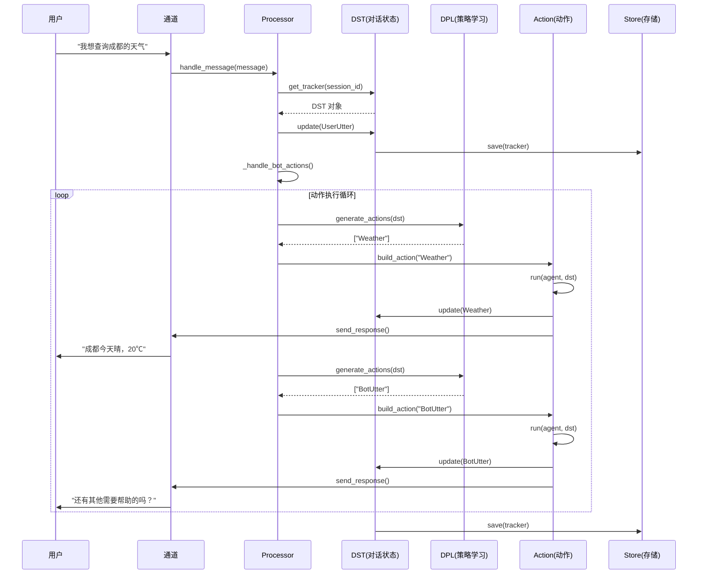

# Cota 代码分析报告

## 📋 项目概述

**Cota** (Chain of Thought Agent Platform) 是一个**工业级任务型对话系统平台**，基于思维链（Chain of Thought）和对话状态跟踪（DST）架构。

**核心理念**：通过标注式策略学习，将领域知识以思维链的形式注入对话系统，无需学习复杂的 Agent 概念，只需编写带思维链的对话示例即可构建可靠的领域 AI 助理。

---

## ✅ 问题 1：这个代码是否可以进行任务型对话？

**答案：是的，Cota 是一个完整的任务型对话系统框架。**

### 证据

#### 1. 对话状态跟踪（DST - Dialogue State Tracker）
- **文件**: `cota/dst.py` (464 行)
- **核心类**: `DST`
- **功能**:
  - 跟踪对话状态（slots、actions、forms）
  - 维护对话历史（actions deque）
  - 支持多轮对话上下文
  - 支持表单（Form）填写模式

```python
class DST:
    """Dialogue State Tracker"""
    def __init__(self, session_id: Text, agent: 'Agent') -> None:
        self.session_id = session_id
        self.agent = agent
        self.slots = {}                    # 槽位状态
        self.actions = deque([])           # 动作历史
        self.formless_actions = deque([])
        self.latest_action = None
        self.current_form = None           # 当前表单
        self.latest_query = None
        self.latest_response = None
```

#### 2. 任务型对话核心组件

| 组件 | 文件 | 功能 |
|------|------|------|
| **DST** | `dst.py` | 对话状态跟踪，维护槽位和对话历史 |
| **DPL** | `dpl/dpl.py` | 对话策略学习，决定下一步动作 |
| **Form** | `actions/form.py` | 表单填写，任务型对话的核心模式 |
| **Action** | `actions/action.py` | 动作执行，包括查询、API 调用等 |
| **Processor** | `processor.py` | 消息处理，协调 DST 和 Action |

#### 3. 任务型对话支持特性

✅ **多轮对话**: 通过 `DST` 维护对话历史和状态
✅ **槽位填充**: 支持 slots 定义和自动填充
✅ **表单模式**: `Form` 类支持任务型对话的表单填写流程
✅ **意图识别**: 通过 `Selector` action 进行意图选择
✅ **API 执行**: 通过 `Executor` 执行外部 API 调用
✅ **任务规划**: `Task` 类支持多 Agent 协作的任务执行

#### 4. 配置文件示例（来自 README）

```yaml
# 无需理解 Agent 概念，只需编写带思维链的对话示例
policies:
  - title: "复杂查天气"
    actions:
      - name: UserUtter
        result: "成都和重庆天气咋样哪个好"
      - name: Selector
        thought: "用户询问两个城市天气，需要先查成都，再查重庆，然后比较"
        result: Weather
      - name: Weather
        result: <成都天气结果>
      - name: Selector
        thought: "已拿到成都天气，还需要查询重庆天气"
        result: Weather
      - name: Weather
        result: <重庆天气结果>
      - name: BotUtter
        thought: "比较两个城市天气，告诉用户哪个更适合旅游"
        result: "成都晴 20℃，重庆阴 18℃，建议去成都"
```

---

## 🚪 问题 2：这个代码的入口是什么？

### 主要入口文件

#### 1. 命令行入口：`cota/__main__.py`

**启动命令**:
```bash
cota run     # 启动对话代理服务
cota shell   # 启动交互式命令行
cota init    # 初始化新项目
cota task    # 启动任务模式（开发中）
```

**核心函数**:
```python
def main():
    parser = create_argument_parser()
    cmdline_arguments = parser.parse_args()
    
    if hasattr(cmdline_arguments, "func"):
        cmdline_arguments.func(cmdline_arguments)
```

**命令路由**:
| 命令 | 函数 | 功能 |
|------|------|------|
| `cota run` | `run(args)` | 启动 WebSocket/Socket.IO/SSE 服务 |
| `cota shell` | `shell(args)` | 启动命令行交互式对话 |
| `cota init` | `init(args)` | 创建项目模板 |
| `cota task` | `task(args)` | 任务模式（暂未完成） |

#### 2. 服务启动入口：`cota/server.py`

```python
def create_app(agent):
    """创建 Sanic 应用"""
    app = Sanic(__name__)
    # 注册路由、中间件等
    return app
```

#### 3. Agent 加载入口：`cota/agent.py`

```python
@classmethod
def load_from_path(cls, path: Text, store: Optional[Store] = None) -> "Agent":
    """从配置文件加载 Agent"""
    agent_config = read_yaml_from_path(os.path.join(path, 'agent.yml'))
    endpoints_config = read_yaml_from_path(os.path.join(path, 'endpoints.yml'))
    
    # 初始化核心组件
    dpl = DPLFactory.create(agent_config, policy_path)
    knowledge = KnowledgeFactory.create(knowledge_configs, path)
    llms = {}  # 初始化 LLM
    
    return cls(...)
```

#### 4. 消息处理入口：`cota/processor.py`

```python
async def handle_message(
        self,
        message: Message,
        channel: Optional[Channel] = None
):
    """处理用户消息的入口"""
    # 1. 创建 UserUtter 动作
    action = Action.build_from_name(name='UserUtter')
    action.run_from_dict({...})
    
    # 2. 获取对话状态跟踪器
    self.dst = await self.get_tracker(message.session_id)
    self.dst.update(action)
    
    # 3. 处理机器人动作
    await self._handle_bot_actions(message.session_id, channel)
```

### 入口流程图

```
用户命令
    ↓
cota/__main__.py (main 函数)
    ↓
┌─────────────┬─────────────┬─────────────┐
│  cota run   │ cota shell  │  cota init  │
│  (服务)     │  (交互)     │  (初始化)   │
└─────────────┴─────────────┴─────────────┘
    ↓               ↓               ↓
server.py       shell()        init()
    ↓               ↓               ↓
Sanic App     Cmdline 通道     创建模板文件
    ↓
Agent.load_from_path()
    ↓
Processor.handle_message()
```

---

## ⚙️ 问题 3：核心机制是如何实现的？

### 核心机制：从用户问句到响应的完整流程

#### 阶段 1：用户消息输入

```
用户：我想查询成都的天气
    ↓
Channel (WebSocket/Socket.IO/Cmdline)
    ↓
Message 对象封装
    ↓
Processor.handle_message()
```

**代码位置**: `cota/processor.py:handle_message()`

```python
async def handle_message(self, message: Message, channel: Optional[Channel] = None):
    # 1. 将用户消息包装为 UserUtter 动作
    action = Action.build_from_name(name='UserUtter')
    action.run_from_dict({
        "result": [message.as_dict()],
        "sender": message.sender or 'user',
        "sender_id": message.sender_id or 'default_user'
    })
    
    # 2. 获取对话状态跟踪器（DST）
    self.dst = await self.get_tracker(message.session_id)
    
    # 3. 更新对话状态
    self.dst.update(action)
    
    # 4. 处理机器人响应
    await self._handle_bot_actions(message.session_id, channel)
```

---

#### 阶段 2：对话状态更新（DST Update）

```
UserUtter 动作
    ↓
DST.update(action)
    ↓
更新 slots、actions、latest_action
    ↓
保存到 Store（持久化）
```

**代码位置**: `cota/dst.py:update()`

```python
def update(self, action: Action) -> None:
    """更新对话状态"""
    action.apply_to(self)  # 动作应用到 DST
```

**DST 核心状态**:
```python
{
    "session_id": "user_123",
    "slots": {"city": "成都", "date": "今天"},  # 槽位状态
    "actions": [UserUtter, Selector, Weather, BotUtter],  # 动作历史
    "current_form": None,  # 当前表单（任务型对话的核心）
    "latest_action": UserUtter,
    "latest_query": "我想查询成都的天气"
}
```

---

#### 阶段 3：动作生成（DPL - Dialogue Policy Learning）

```
DST 当前状态
    ↓
Agent.generate_actions(dst)
    ↓
DPL.generate_actions(dst)  # 策略学习
    ↓
返回下一步动作名称列表
```

**代码位置**: `cota/agent.py:generate_actions()`

```python
async def generate_actions(self, dst: DST) -> List[Action]:
    """基于 DPL 生成对应动作"""
    
    # 1. 如果正在填写表单，优先处理表单
    if dst.current_form:
        return await self._handle_current_form(dst)
    
    # 2. 使用 DPL 生成动作
    if self.dpl:
        action_names = await self.dpl.generate_actions(dst)
        if action_names:
            return [self.build_action(action_names[0])]
    
    # 3. 降级到 Selector（意图识别）
    selector = self.build_action(action_name='Selector')
    await selector.run(agent=self, dst=dst)
    dst.update(selector)
    
    # 4. 根据选择结果返回动作
    if len(selector.result) == 0:
        return [self.build_action('BotUtter')]  # 无匹配，回复默认消息
    else:
        action_name, action_params = action_infos[0]
        return [self.build_action(action_name, **action_params)]
```

**DPL 策略类型** (`cota/dpl/dpl.py`):
| 类型 | 类 | 功能 |
|------|-----|------|
| `trigger` | `TriggerDPL` | 基于关键词触发 |
| `match` | `MatchDPL` | 基于语义匹配 |
| `llm` | `LLMDPL` | 基于 LLM 推理 |

**CompositeDPL 模式**:
```python
class CompositeDPL(DPL):
    """管理多个 DPL 策略，返回第一个非空结果"""
    
    async def generate_actions(self, dst: 'DST') -> Optional[List[Text]]:
        for strategy in self.strategies:  # 遍历所有策略
            result = await strategy.generate_actions(dst)
            if result:
                return result  # 返回第一个成功的结果
        return None
```

---

#### 阶段 4：动作执行

```
动作列表 [Weather, BotUtter]
    ↓
Action.run(agent, dst)
    ↓
执行具体逻辑（API 调用、LLM 生成等）
    ↓
更新 DST 状态
    ↓
发送响应到 Channel
```

**代码位置**: `cota/processor.py:_handle_bot_actions()`

```python
async def _handle_bot_actions(self, session_id: Text, channel: Optional[Channel] = None):
    """处理机器人动作循环"""
    while True:
        # 1. 生成下一步动作
        bot_actions = await self.agent.generate_actions(self.dst)
        
        # 2. 执行每个动作
        for action_item in bot_actions:
            await action_item.run(self.agent, self.dst)  # 执行动作
            self.dst.update(action_item)  # 更新状态
            
            # 3. 发送响应到通道
            if channel:
                await self.execute_channel_effects(action_item, session_id, channel)
            
            # 4. 如果是 BotUtter，结束循环
            if isinstance(action_item, BotUtter):
                return
```

**动作类型** (`cota/actions/`):
| 动作 | 文件 | 功能 |
|------|------|------|
| `UserUtter` | `user_utter.py` | 用户输入 |
| `BotUtter` | `bot_utter.py` | 机器人回复 |
| `Selector` | `selector.py` | 意图选择 |
| `Form` | `form.py` | 表单填写 |
| `RAG` | `rag.py` | 检索增强生成 |

---

#### 阶段 5：响应输出

```
BotUtter 动作结果
    ↓
Channel.send_response()
    ↓
用户收到回复
```

**代码位置**: `cota/processor.py:execute_channel_effects()`

```python
async def execute_channel_effects(
        self,
        action: Action,
        session_id: Text,
        channel: Channel,
):
    """执行通道效果（发送响应）"""
    if isinstance(action, UserUtter):
        for res in action.result:
            await channel.send_response(session_id, copy.deepcopy(res))
    elif isinstance(action, BotUtter):
        for res in action.result:
            await channel.send_response(session_id, copy.deepcopy(res))
```

---

### 完整流程图



---

### 核心机制总结

| 机制 | 实现方式 | 代码位置 |
|------|---------|---------|
| **对话状态跟踪** | DST 类维护 slots、actions、forms | `cota/dst.py` |
| **策略学习** | DPL 工厂模式，支持 trigger/match/llm | `cota/dpl/dpl.py` |
| **动作执行** | Action 基类 + 具体实现（UserUtter/BotUtter/Form） | `cota/actions/` |
| **多轮对话** | DST 维护对话历史 deque | `cota/dst.py:actions` |
| **表单填写** | Form 类支持槽位填充流程 | `cota/actions/form.py` |
| **持久化** | Store 接口支持 Memory/SQL | `cota/store.py` |
| **通道抽象** | Channel 基类支持 WebSocket/Socket.IO/Cmdline | `cota/channels/` |

---

## 📂 问题 4：项目结构

```
cota/
├── __main__.py              # 命令行入口
├── agent.py                 # Agent 核心类
├── processor.py             # 消息处理器
├── dst.py                   # 对话状态跟踪器
├── task.py                  # 任务规划器
├── store.py                 # 存储接口
├── server.py                # Sanic 服务
│
├── actions/                 # 动作模块
│   ├── action.py           # Action 基类
│   ├── user_utter.py       # 用户输入动作
│   ├── bot_utter.py        # 机器人回复动作
│   ├── selector.py         # 意图选择动作
│   ├── form.py             # 表单填写动作
│   ├── rag.py              # RAG 动作
│   └── executors/          # 执行器（HTTP 等）
│
├── dpl/                     # 对话策略学习
│   ├── dpl.py              # DPL 基类和工厂
│   ├── trigger.py          # 触发式策略
│   ├── match.py            # 匹配式策略
│   └── llm.py              # LLM 驱动策略
│
├── channels/                # 通信通道
│   ├── channel.py          # Channel 基类
│   ├── websocket.py        # WebSocket 通道
│   ├── socketio.py         # Socket.IO 通道
│   ├── cmdline.py          # 命令行通道
│   └── sse.py              # SSE 通道
│
├── llm/                     # LLM 接口
│   ├── llm.py              # LLM 基类
│   └── providers/          # LLM 提供商（OpenAI 等）
│
├── knowledge/               # 知识库
│   └── knowledge.py        # 知识检索
│
├── bots/                    # 机器人模板
│   └── ...                 # 示例机器人配置
│
└── utils/                   # 工具函数
    ├── io.py               # YAML 读写
    ├── common.py           # 通用工具
    └── http.py             # HTTP 客户端
```

---

## 🎯 任务型对话实现总结

### Cota 如何支持任务型对话？

1. **DST（对话状态跟踪）**
   - 维护槽位状态（slots）
   - 跟踪对话历史（actions）
   - 支持表单模式（current_form）

2. **DPL（对话策略学习）**
   - 基于思维链标注学习策略
   - 支持多种策略（trigger/match/llm）
   - CompositeDPL 支持策略组合

3. **Form（表单填写）**
   - 定义任务所需的槽位
   - 自动询问缺失槽位
   - 支持槽位验证和填充

4. **Action（动作执行）**
   - 支持 API 调用（Executor）
   - 支持 LLM 生成
   - 支持 RAG 检索

5. **Task（任务规划）**
   - 多 Agent 协作
   - DAG 任务执行流
   - LLM 任务分解

---

## 📝 调研内容保存位置

**文件路径**: `/Users/maomin/programs/vscode/cota/detail_code_explain/`

**生成的文件**:
1. `01_任务型对话能力分析.md` - 本文件
2. `02_代码入口分析.md` - 入口点和启动流程
3. `03_核心机制详解.md` - 从用户问句到响应的完整流程
4. `04_架构图解.md` - Mermaid 流程图和架构图
5. `05_总结与建议.md` - 总结和使用建议

---

**分析完成时间**: 2026-03-16
**分析师**: AI 助手（基于 code-rag-skill 和记忆检索）
**状态**: ✅ 完成
