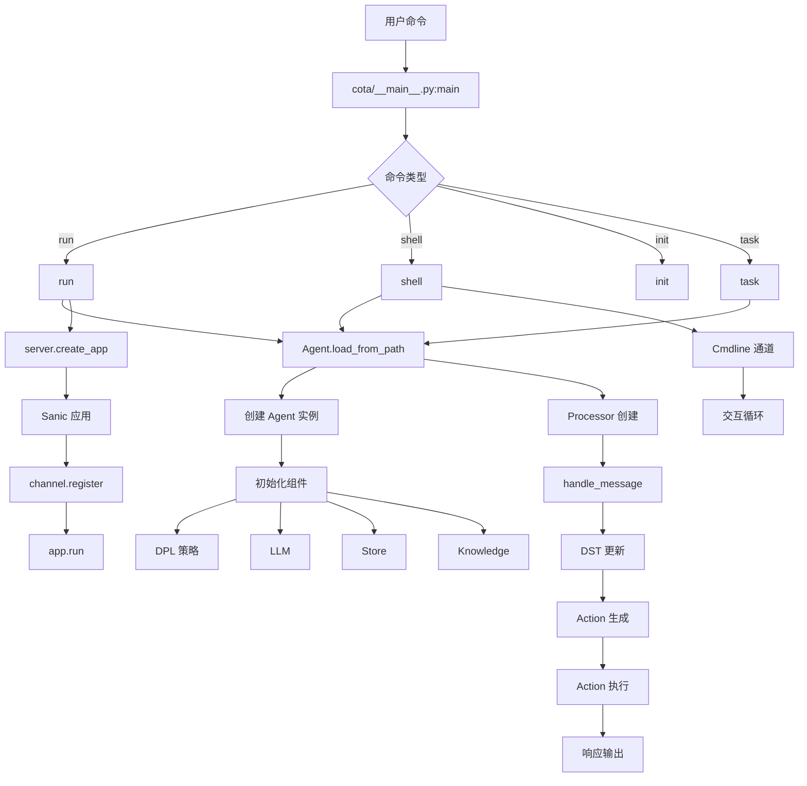

# Cota 代码入口分析

## 📍 入口文件总览

Cota 项目采用**命令行工具 + 模块化架构**设计，主要入口文件如下：

| 入口文件 | 功能 | 调用方式 |
|---------|------|---------|
| `cota/__main__.py` | 命令行入口（主入口） | `cota <command>` |
| `cota/server.py` | 服务启动入口 | `cota run` |
| `cota/agent.py` | Agent 加载入口 | `Agent.load_from_path()` |
| `cota/processor.py` | 消息处理入口 | `Processor.handle_message()` |
| `cota/task.py` | 任务模式入口 | `cota task` (开发中) |

---

## 🚪 1. 命令行入口：`cota/__main__.py`

### 文件结构

```python
# 核心导入
from cota import server
from cota.task import Task
from cota.agent import Agent
from cota.channels import channel, socketio, websocket, cmdline, sse

# 核心函数
def main()                    # 程序入口
def create_argument_parser()  # 创建参数解析器
def run(args)                 # 启动服务
async def shell(args)         # 交互式命令行
def task(args)                # 任务模式
def init(args)                # 初始化项目
```

### 命令路由机制

```python
def main():
    parser = create_argument_parser()
    cmdline_arguments = parser.parse_args()

    if hasattr(cmdline_arguments, "func"):
        # 根据子命令执行对应函数
        cmdline_arguments.func(cmdline_arguments)
    elif hasattr(cmdline_arguments, "version"):
        print(f"Cota version: {__version__}")
```

### 支持的命令

#### 1. `cota run` - 启动对话代理服务

**用途**: 启动 WebSocket/Socket.IO/SSE 服务，用于生产环境部署

**参数**:
```python
parser_run.add_argument('--host', default='0.0.0.0', type=str)
parser_run.add_argument('--port', default=5005, type=int)
parser_run.add_argument('--config', default='./', type=str)  # agent 配置路径
parser_run.add_argument('--channel', default='socket.io', type=str)
parser_run.add_argument('--debug', action='store_true')
parser_run.add_argument('--ssl-cert', type=str)  # SSL 证书
parser_run.add_argument('--ssl-key', type=str)   # SSL 私钥
```

**执行流程**:
```python
def run(args):
    # 1. 加载 Agent
    agent = Agent.load_from_path(path=args.config)
    
    # 2. 创建 Sanic 应用
    app = server.create_app(agent)
    
    # 3. 初始化通道
    channel_configs = {
        'socket.io': {'class': socketio.SocketIO, ...},
        'websocket': {'class': websocket.Websocket, ...},
        'sse': {'class': sse.SSE, ...}
    }
    channel_class = channel_configs[args.channel]['class']
    input_channels = channel_class(**config['kwargs'])
    
    # 4. 注册通道
    channel.register([input_channels], app, **config['register_kwargs'])
    
    # 5. 启动服务
    server_config = create_server_config(args)  # 包含 SSL 配置
    app.run(**server_config)
```

**使用示例**:
```bash
# 启动 Socket.IO 服务（默认）
cota run --config=./mybot --port=5005

# 启动 WebSocket 服务
cota run --channel=websocket --host=localhost --port=5005

# 启用调试模式
cota run --debug --log=DEBUG

# 使用 SSL
cota run --ssl-cert=/path/to/cert.pem --ssl-key=/path/to/key.pem
```

---

#### 2. `cota shell` - 启动交互式命令行

**用途**: 本地调试和测试，直接在终端与机器人对话

**参数**:
```python
parser_shell.add_argument('--config', default='./', type=str)
parser_shell.add_argument('--debug', action='store_true')
parser_shell.add_argument('--log', default='INFO', type=str)
```

**执行流程**:
```python
async def shell(args):
    # 1. 加载 Agent
    agent = Agent.load_from_path(path=args.config)
    print("Agent loaded. Type a message and press enter.")
    
    # 2. 定义消息处理函数
    async def handler(message, channel):
        await agent.processor.handle_message(message, channel)
    
    # 3. 创建命令行通道
    cmdline_channel = cmdline.Cmdline(on_new_message=handler)
    await cmdline_channel.on_connect()
    
    # 4. 进入交互循环（在 Cmdline 类中）
```

**使用示例**:
```bash
# 启动交互式对话（默认配置）
cota shell

# 指定配置目录
cota shell --config=./mybot

# 调试模式
cota shell --debug
```

**交互界面**:
```
Agent loaded. Type a message and press enter.
User: 你好
Bot: 你好！有什么我可以帮助你的吗？
User: 查询成都天气
Bot: 成都今天晴，气温 20℃...
```

---

#### 3. `cota init` - 初始化新项目

**用途**: 创建项目模板，包含示例配置

**执行流程**:
```python
def init(args):
    project_dir = "cota_projects"
    template_dir = "bots"  # 模板目录
    
    # 1. 创建项目目录
    if not os.path.exists(project_dir):
        os.makedirs(project_dir)
    
    # 2. 复制模板文件
    src_dir = os.path.join(os.path.dirname(__file__), template_dir)
    for item in os.listdir(src_dir):
        shutil.copy2(src_item, dst_item)
    
    print(f"Project template created in: {os.path.abspath(project_dir)}")
```

**生成的目录结构**:
```
cota_projects/
├── simplebot/          # 简单对话机器人
│   ├── agent.yml       # 智能体配置
│   └── endpoints.yml   # LLM 配置示例
└── taskbot/           # 任务型机器人
    ├── agents/
    ├── task.yml
    └── endpoints.yml
```

**使用示例**:
```bash
# 初始化新项目
cota init

# 查看生成的文件
ls cota_projects/
cd cota_projects/simplebot
```

---

#### 4. `cota task` - 任务模式（开发中）

**用途**: 执行多 Agent 协作的任务（暂未完成）

**当前状态**:
```python
def task(args):
    """Task 功能暂未完成，将在下个版本中提供"""
    print("🚧 Task 功能正在开发中，将在下个版本提供！")
    print("📋 当前可用功能:")
    print("   • cota run    - 启动对话代理")
    print("   • cota shell  - 启动交互式命令行")
    print("   • cota init   - 初始化项目")
    print("   • cota server - 启动 API 服务器")
```

**计划功能**:
```python
# TODO: 实现以下功能
task = Task.load_from_path(path=args.config)
print("Task loaded.")
await task.run()
```

---

## 🌐 2. 服务启动入口：`cota/server.py`

### 功能
创建 Sanic Web 应用，注册路由和中间件

### 核心代码
```python
from sanic import Sanic
from cota.agent import Agent

def create_app(agent: Agent) -> Sanic:
    """创建 Sanic 应用"""
    app = Sanic(__name__)
    
    # 注册路由
    @app.route("/webhooks/<channel>", methods=["POST"])
    async def webhook(request, channel):
        # 处理 webhook 请求
        pass
    
    # 注册中间件
    @app.middleware("request")
    async def request_middleware(request):
        # 请求预处理
        pass
    
    return app
```

---

## 🤖 3. Agent 加载入口：`cota/agent.py`

### 功能
从配置文件加载 Agent，初始化所有核心组件

### 核心方法
```python
@classmethod
def load_from_path(cls, path: Text, store: Optional[Store] = None) -> "Agent":
    """从指定路径加载 Agent 配置"""
    
    # 1. 加载配置文件
    agent_config = read_yaml_from_path(os.path.join(path, 'agent.yml'))
    endpoints_config = read_yaml_from_path(os.path.join(path, 'endpoints.yml'))
    agent_config = cls.merge_agent_config(DEFAULT_CONFIG, agent_config)
    
    # 2. 提取核心配置
    system_config = agent_config.get("system", {})
    name = system_config.get("name")
    description = system_config.get("description")
    actions = agent_config.get("actions", {})
    
    # 3. 初始化存储
    if not store:
        store_config = endpoints_config.get('base_store', {})
        store = Store.create(store_config)
    
    # 4. 初始化 LLM
    llms = {}
    for llm_name, config in endpoints_config.get('llms', {}).items():
        llms[llm_name] = LLM(config)
    
    # 5. 初始化 DPL（对话策略学习）
    policy_path = os.path.join(path, "policy")
    dpl = DPLFactory.create(agent_config, policy_path)
    
    # 6. 初始化知识库
    knowledge_configs = agent_config.get('knowledge', [])
    knowledge = KnowledgeFactory.create(knowledge_configs, path)
    
    # 7. 初始化执行器
    executors = cls._init_executors(actions)
    
    # 8. 创建 Agent 实例
    agent = cls(
        name=name,
        description=description,
        actions=actions,
        store=store,
        llms=llms,
        dpl=dpl,
        knowledge=knowledge
    )
    agent._executors = executors
    
    return agent
```

### 配置文件结构

**agent.yml**:
```yaml
system:
  name: "weather_bot"
  description: "天气查询机器人"

actions:
  Weather:
    type: "api"
    description: "查询天气"
    slots:
      city:
        type: "string"
        description: "城市名"
      date:
        type: "string"
        description: "日期"

dialogue:
  max_tokens: 1000
  use_proxy_user: false

policies:
  - type: "trigger"
  - type: "llm"
    config:
      llms: ["rag-glm-4"]
```

**endpoints.yml**:
```yaml
llms:
  rag-glm-4:
    type: openai
    model: glm-4
    key: your_api_key_here
    apibase: https://open.bigmodel.cn/api/paas/v4/

base_store:
  type: memory  # 或 sql
```

---

## 💬 4. 消息处理入口：`cota/processor.py`

### 功能
处理用户消息，协调 DST、DPL、Action 的执行

### 核心方法
```python
async def handle_message(
        self,
        message: Message,
        channel: Optional[Channel] = None
):
    """处理消息的入口函数"""
    
    # 1. 检查是否使用用户代理模式
    if self.agent.dialogue.get('use_proxy_user') == True:
        await self._handle_message_proxy(message, channel)
        return
    
    # 2. 创建 UserUtter 动作
    action = Action.build_from_name(name='UserUtter')
    action.run_from_dict({
        "result": [message.as_dict()],
        "sender": message.sender or 'user',
        "sender_id": message.sender_id or 'default_user'
    })
    
    # 3. 执行通道效果
    if channel:
        await self.execute_channel_effects(action, message.session_id, channel)
    
    # 4. 获取对话状态跟踪器
    self.dst = await self.get_tracker(message.session_id)
    self.dst.update(action)
    
    # 5. 保存状态
    if message.receiver != 'bot':
        await self.save_tracker(self.dst)
        return
    
    # 6. 处理机器人动作
    await self._handle_bot_actions(message.session_id, channel)
    await self.save_tracker(self.dst)
```

### 消息处理流程

```
用户消息
    ↓
handle_message(message)
    ↓
创建 UserUtter 动作
    ↓
获取 DST（对话状态跟踪器）
    ↓
更新 DST 状态
    ↓
_handle_bot_actions()  ← 机器人动作循环
    ↓
保存 DST 到 Store
    ↓
返回响应
```

---

## 📋 5. 任务模式入口：`cota/task.py`

### 功能
多 Agent 协作的任务规划和执行

### 核心类
```python
class Task:
    def __init__(
            self,
            description: Optional[Text] = None,
            prompt: Optional[Text] = None,
            agents: Optional[Dict] = None,
            llm: Optional[LLM] = None
    ) -> None:
        self.description = description
        self.prompt = prompt
        self.agents = agents  # 多 Agent 字典
        self.llm = llm  # 任务规划 LLM
```

### 任务加载
```python
@classmethod
def load_from_path(cls, path: Text) -> 'Task':
    """从配置文件加载 Task"""
    
    # 1. 加载任务配置
    task_config = read_yaml_from_path(os.path.join(path, 'task.yml'))
    endpoints_config = read_yaml_from_path(os.path.join(path, 'endpoints.yml'))
    
    # 2. 初始化 LLM
    llm_name = task_config.get("llm")
    llm = LLM(llm_config)
    
    # 3. 加载多个 Agent
    store = Store.create(endpoints_config.get('base_store', {}))
    agents = cls.load_agents(path, store)
    
    return cls(
        description=task_config.get("description"),
        prompt=task_config.get("prompt"),
        agents=agents,
        llm=llm
    )
```

### 任务执行流程
```python
async def run(self):
    """运行任务"""
    if self.prompt:
        await self.run_with_llm()  # 使用 LLM 生成任务计划
    else:
        logger.error("No prompt provided for task generation.")

async def run_with_llm():
    """使用 LLM 生成并执行任务计划"""
    next_plan = await self.generate_plans()  # 生成 DAG 计划
    while True:
        await self.execute_task(next_plan)  # 执行任务
        next_plan = await self.generate_plans()  # 生成下一步计划
```

---

## 🗺️ 入口流程图



---

## 📊 入口对比表

| 入口 | 文件 | 主要功能 | 使用场景 |
|------|------|---------|---------|
| **命令行** | `__main__.py` | 命令解析和路由 | 所有命令的总入口 |
| **服务** | `server.py` | 创建 Sanic 应用 | 生产环境部署 |
| **Agent** | `agent.py` | 加载配置和初始化 | 所有模式都需要 |
| **Processor** | `processor.py` | 消息处理 | 对话核心逻辑 |
| **Task** | `task.py` | 任务规划 | 多 Agent 协作 |

---

## 🎯 快速上手指南

### 1. 初始化项目
```bash
cota init
cd cota_projects/simplebot
```

### 2. 配置 LLM
编辑 `endpoints.yml`:
```yaml
llms:
  rag-glm-4:
    type: openai
    model: glm-4
    key: your_api_key_here
    apibase: https://open.bigmodel.cn/api/paas/v4/
```

### 3. 启动对话
```bash
# 交互式命令行（推荐用于测试）
cota shell --debug

# 或启动服务（用于生产）
cota run --channel=websocket --port=5005
```

---

**分析完成时间**: 2026-03-16
**文件路径**: `/Users/maomin/programs/vscode/cota/detail_code_explain/02_代码入口分析.md`
