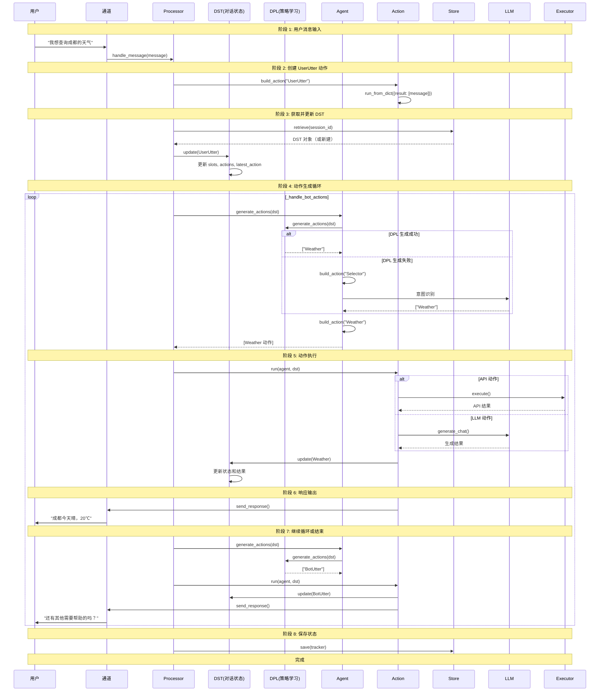

# Cota 核心机制详解

## 📖 从用户问句到响应的完整流程

本文档详细解析 Cota 如何从用户输入开始，经过对话状态跟踪、策略学习、动作执行，最终生成响应的完整过程。

---

## 🔄 完整流程概览



---

## 📝 阶段 1: 用户消息输入

### 1.1 通道接收消息

**代码位置**: `cota/channels/channel.py`

```python
class Channel:
    async def send_response(self, session_id: Text, response: Dict):
        """发送响应到用户"""
        pass
    
    async def on_new_message(self, message: Message, handler: Callable):
        """接收新消息并调用处理器"""
        pass
```

**不同通道的实现**:
| 通道 | 文件 | 协议 |
|------|------|------|
| WebSocket | `websocket.py` | WebSocket |
| Socket.IO | `socketio.py` | Socket.IO |
| SSE | `sse.py` | Server-Sent Events |
| Cmdline | `cmdline.py` | 命令行输入 |

### 1.2 Message 对象封装

**代码位置**: `cota/message/message.py`

```python
class Message:
    def __init__(
            self,
            text: Text,
            sender: Optional[Text] = None,
            sender_id: Optional[Text] = None,
            receiver: Optional[Text] = None,
            receiver_id: Optional[Text] = None,
            session_id: Optional[Text] = None,
            metadata: Optional[Dict] = None
    ):
        self.text = text
        self.sender = sender
        self.sender_id = sender_id
        self.receiver = receiver
        self.receiver_id = receiver_id
        self.session_id = session_id
        self.metadata = metadata or {}
    
    def as_dict(self) -> Dict:
        return {
            "text": self.text,
            "sender": self.sender,
            "sender_id": self.sender_id,
            ...
        }
```

---

## 🎯 阶段 2: 创建 UserUtter 动作

### 2.1 构建动作

**代码位置**: `cota/processor.py:handle_message()`

```python
async def handle_message(self, message: Message, channel: Optional[Channel] = None):
    # 1. 创建 UserUtter 动作
    action = Action.build_from_name(name='UserUtter')
    action.run_from_dict({
        "result": [message.as_dict()],
        "sender": message.sender or 'user',
        "sender_id": message.sender_id or 'default_user',
        "receiver": message.receiver or 'bot',
        "receiver_id": message.receiver_id or 'default_bot'
    })
```

### 2.2 Action 基类

**代码位置**: `cota/actions/action.py`

```python
class Action:
    def __init__(
            self,
            name: Text,
            description: Optional[Text] = None,
            prompt: Optional[Text] = None,
            llm: Optional[Text] = None,
            sender: Optional[Text] = None,
            sender_id: Optional[Text] = None
    ):
        self.name = name
        self.description = description
        self.prompt = prompt
        self.llm = llm
        self.sender = sender
        self.sender_id = sender_id
        self.result = []
        self.timestamp = time.time()
    
    @classmethod
    def build_from_name(cls, name: Text, **kwargs) -> "Action":
        """根据名称构建动作实例"""
        # 映射动作名称到具体类
        action_classes = {
            'UserUtter': UserUtter,
            'BotUtter': BotUtter,
            'Selector': Selector,
            'Form': Form,
            'RAG': RAG,
            ...
        }
        action_class = action_classes.get(name, Action)
        return action_class(name=name, **kwargs)
    
    async def run(self, agent: 'Agent', dst: DST):
        """执行动作（子类重写）"""
        pass
    
    def apply_to(self, dst: DST):
        """将动作结果应用到 DST"""
        dst.latest_action = self
        dst.actions.append(self)
        if self.result:
            # 更新 slots 等状态
            pass
    
    def as_dict(self) -> Dict:
        """序列化为字典"""
        return {
            "name": self.name,
            "result": self.result,
            "timestamp": self.timestamp,
            ...
        }
```

---

## 📊 阶段 3: 获取并更新 DST

### 3.1 获取对话状态跟踪器

**代码位置**: `cota/processor.py:get_tracker()`

```python
async def get_tracker(self, session_id: Text) -> Optional[DST]:
    """根据 session_id 获取跟踪器"""
    # 1. 从 Store 检索历史动作
    actions_dict = await self.store.retrieve(session_id)
    
    if actions_dict is None:
        # 新建 DST
        return DST(session_id=session_id, agent=self.agent)
    else:
        # 从历史动作恢复 DST
        tracker = DST.from_dict(
            dst_dict={"session_id": session_id, "actions": actions_dict},
            agent=self.agent
        )
        return tracker
```

### 3.2 DST 核心结构

**代码位置**: `cota/dst.py`

```python
class DST:
    """Dialogue State Tracker - 对话状态跟踪器"""
    
    def __init__(self, session_id: Text, agent: 'Agent') -> None:
        self.session_id = session_id
        self.agent = agent
        
        # 核心状态
        self.slots = {}                    # 槽位状态 {city: "成都", date: "今天"}
        self.actions = deque([])           # 动作历史队列
        self.formless_actions = deque([])
        self.latest_action = None          # 最新动作
        self.current_form = None           # 当前表单（任务型对话核心）
        self.latest_query = None           # 最新用户查询
        self.latest_response = None        # 最新机器人响应
        self.latest_sender_id = None
        self.latest_receiver_id = None
    
    def update(self, action: Action) -> None:
        """更新对话状态"""
        action.apply_to(self)  # 动作应用到 DST
    
    def current_state(self) -> Dict:
        """获取当前状态"""
        actions = [action.as_dict() for action in self.actions]
        return {
            "session_id": self.session_id,
            "slots": self.slots,
            "actions": actions
        }
```

### 3.3 更新 DST 状态

**代码位置**: `cota/actions/user_utter.py`

```python
class UserUtter(Action):
    def apply_to(self, dst: DST):
        """应用 UserUtter 到 DST"""
        dst.latest_action = self
        dst.actions.append(self)
        dst.latest_query = self.result[0].get('text') if self.result else None
        dst.latest_sender_id = self.sender_id
        
        # 提取槽位（如果配置了槽位提取）
        if self.result and self.result[0].get('slots'):
            dst.slots.update(self.result[0]['slots'])
```

**DST 状态变化示例**:

**更新前**:
```python
{
    "session_id": "user_123",
    "slots": {},
    "actions": [],
    "latest_action": None,
    "current_form": None
}
```

**更新后**:
```python
{
    "session_id": "user_123",
    "slots": {"city": "成都"},  # 从用户输入提取
    "actions": [UserUtter],
    "latest_action": UserUtter,
    "latest_query": "我想查询成都的天气",
    "current_form": None
}
```

---

## 🧠 阶段 4: 动作生成（DPL）

### 4.1 Agent 生成动作

**代码位置**: `cota/agent.py:generate_actions()`

```python
async def generate_actions(self, dst: DST) -> List[Action]:
    """基于 DPL 生成对应动作"""
    
    # 1. 如果正在填写表单，优先处理表单
    if dst.current_form:
        return await self._handle_current_form(dst)
    
    # 2. 使用 DPL 生成动作名称
    if self.dpl:
        action_names = await self.dpl.generate_actions(dst)
        if action_names:
            # 只取第一个动作（单动作模式）
            first_action_name = action_names[0]
            return [self.build_action(first_action_name)]
    
    # 3. 降级到 Selector（意图识别）
    selector = self.build_action(action_name='Selector')
    await selector.run(agent=self, dst=dst)
    dst.update(selector)
    
    if len(selector.result) == 0:
        # 无匹配，返回 BotUtter
        return [self.build_action('BotUtter')]
    else:
        # 提取选择的动作
        action_infos = self._extract_action_info(selector)
        if action_infos:
            action_name, action_params = action_infos[0]
            return [self.build_action(action_name, **action_params)]
        else:
            return [self.build_action('BotUtter')]
```

### 4.2 DPL 策略学习

**代码位置**: `cota/dpl/dpl.py`

```python
class DPL:
    """对话策略学习基类"""
    
    async def generate_thoughts(self, dst: 'DST', action: 'Action') -> Optional[Text]:
        """生成下一步的思维链"""
        return None
    
    async def generate_actions(self, dst: 'DST') -> Optional[List[Text]]:
        """生成下一步动作名称"""
        return None


class CompositeDPL(DPL):
    """组合多个 DPL 策略"""
    
    def __init__(self, strategies: List[DPL]):
        self.strategies = strategies
    
    async def generate_actions(self, dst: 'DST') -> Optional[List[Text]]:
        """遍历策略，返回第一个非空结果"""
        for strategy in self.strategies:
            try:
                result = await strategy.generate_actions(dst)
                if result:
                    logger.debug(f"Actions generated by {strategy.__class__.__name__}: {result}")
                    return result
            except Exception as e:
                logger.error(f"Strategy {strategy.__class__.__name__} failed: {e}")
                continue
        return None
```

### 4.3 DPL 策略类型

#### TriggerDPL（触发式）
**代码位置**: `cota/dpl/trigger.py`

```python
class TriggerDPL(DPL):
    """基于关键词触发的策略"""
    
    async def generate_actions(self, dst: DST) -> Optional[List[Text]]:
        # 读取 policy 文件中的触发规则
        # 匹配用户输入中的关键词
        # 返回对应的动作名称
        pass
```

#### MatchDPL（匹配式）
**代码位置**: `cota/dpl/match.py`

```python
class MatchDPL(DPL):
    """基于语义匹配的策略"""
    
    async def generate_actions(self, dst: DST) -> Optional[List[Text]]:
        # 使用向量相似度匹配历史对话
        # 返回最相似对话的下一步动作
        pass
```

#### LLMDPL（LLM 驱动）
**代码位置**: `cota/dpl/llm.py`

```python
class LLMDPL(DPL):
    """基于 LLM 推理的策略"""
    
    async def generate_actions(self, dst: DST) -> Optional[List[Text]]:
        # 构建提示词，包含对话历史和可用动作
        prompt = self.build_prompt(dst)
        
        # 调用 LLM 生成动作
        result = await self.llm.generate_chat(
            messages=[{"role": "user", "content": prompt}],
            response_format={'type': 'json_object'}
        )
        
        # 解析 LLM 返回的动作名称
        action_names = json.loads(result["content"])["actions"]
        return action_names
```

---

## ⚡ 阶段 5: 动作执行

### 5.1 动作执行循环

**代码位置**: `cota/processor.py:_handle_bot_actions()`

```python
async def _handle_bot_actions(self, session_id: Text, channel: Optional[Channel] = None):
    """处理机器人动作循环"""
    while True:
        # 1. 生成下一步动作
        bot_actions = await self.agent.generate_actions(self.dst)
        
        # 2. 执行每个动作
        for action_item in bot_actions:
            # 执行动作
            await action_item.run(self.agent, self.dst)
            
            # 更新 DST
            self.dst.update(action_item)
            logger.debug(f"After DST updated: \n {self.dst.current_state()}")
            
            # 发送响应到通道
            if channel:
                await self.execute_channel_effects(action_item, session_id, channel)
            
            # 如果是 BotUtter，结束循环
            if isinstance(action_item, BotUtter):
                return
        
        # 特殊情况处理
        if len(bot_actions) > 1 and isinstance(bot_actions[-1], Form) and isinstance(bot_actions[-2], BotUtter):
            break
```

### 5.2 Action 执行

**代码位置**: `cota/actions/action.py`

```python
class Action:
    async def run(self, agent: 'Agent', dst: DST):
        """执行动作（子类重写）"""
        
        # 1. 如果有 prompt，使用 LLM 生成
        if self.prompt:
            # 格式化 prompt（替换{{variable}}）
            formatted_prompt = dst.format_prompt(self.prompt, self)
            
            # 调用 LLM
            result = await agent.llm_instance(self.llm).generate_chat(
                messages=[{"role": "user", "content": formatted_prompt}],
                max_tokens=1000
            )
            
            self.result = [{"text": result["content"]}]
        
        # 2. 如果有 executor，执行外部 API
        executor = agent.get_executor(self.name)
        if executor:
            api_result = await executor.execute(self, dst)
            self.result = [api_result]
```

### 5.3 动作类型详解

#### UserUtter（用户输入）
**代码位置**: `cota/actions/user_utter.py`

```python
class UserUtter(Action):
    """用户输入动作"""
    
    async def run(self, agent, dst):
        # UserUtter 通常不需要执行，只是包装用户输入
        pass
```

#### BotUtter（机器人回复）
**代码位置**: `cota/actions/bot_utter.py`

```python
class BotUtter(Action):
    """机器人回复动作"""
    
    async def run(self, agent, dst):
        # 使用 LLM 生成回复
        if self.prompt:
            formatted_prompt = dst.format_prompt(self.prompt, self)
            result = await agent.llm_instance(self.llm).generate_chat(
                messages=dst.extract_messages(),  # 对话历史
                max_tokens=500
            )
            self.result = [{"text": result["content"]}]
```

#### Selector（意图选择）
**代码位置**: `cota/actions/selector.py`

```python
class Selector(Action):
    """意图选择动作"""
    
    async def run(self, agent, dst):
        # 使用 LLM 识别用户意图
        prompt = self.build_prompt(dst)
        result = await agent.llm_instance(self.llm).generate_chat(
            messages=[{"role": "user", "content": prompt}],
            response_format={'type': 'json_object'}
        )
        
        # 解析选择的动作
        self.result = json.loads(result["content"])["actions"]
```

#### Form（表单填写）
**代码位置**: `cota/actions/form.py`

```python
class Form(Action):
    """表单填写动作"""
    
    async def run(self, agent, dst):
        if self.state == "start":
            # 开始填写表单
            dst.current_form = self
        
        elif self.state == "continue":
            # 继续填写，收集缺失的槽位
            required_slot = self.first_empty_slot(dst)
            if required_slot:
                # 询问用户缺失的槽位
                self.result = [{"text": f"请问{required_slot}是什么？"}]
            else:
                # 所有槽位已填充，执行表单
                result = await self.submit(agent, dst)
                self.result = [result]
                dst.current_form = None
        
        elif self.state == "break":
            # 中断表单
            dst.current_form = None
```

---

## 📤 阶段 6: 响应输出

### 6.1 通道效果执行

**代码位置**: `cota/processor.py:execute_channel_effects()`

```python
async def execute_channel_effects(
        self,
        action: Action,
        session_id: Text,
        channel: Channel,
):
    """执行通道效果（发送响应）"""
    if isinstance(action, UserUtter):
        for res in action.result:
            await channel.send_response(session_id, copy.deepcopy(res))
    elif isinstance(action, BotUtter):
        for res in action.result:
            await channel.send_response(session_id, copy.deepcopy(res))
```

### 6.2 通道发送响应

**代码位置**: `cota/channels/channel.py`

```python
class Channel:
    async def send_response(self, session_id: Text, response: Dict):
        """发送响应到用户"""
        # 子类实现具体的发送逻辑
        pass
```

**WebSocket 实现**:
```python
class Websocket(Channel):
    async def send_response(self, session_id: Text, response: Dict):
        # 通过 WebSocket 发送
        await self.websocket.send(json.dumps(response))
```

---

## 💾 阶段 7: 保存状态

### 7.1 保存到 Store

**代码位置**: `cota/processor.py:save_tracker()`

```python
async def save_tracker(self, tracker: DST) -> None:
    """保存跟踪器到存储"""
    await self.store.save(tracker)
```

### 7.2 Store 接口

**代码位置**: `cota/store.py`

```python
class Store:
    @classmethod
    def create(cls, config: Dict) -> "Store":
        """根据配置创建存储实例"""
        store_type = config.get('type', 'memory')
        if store_type == 'memory':
            return MemoryStore()
        elif store_type == 'sql':
            return SQLStore(config)
        else:
            raise ValueError(f"Unknown store type: {store_type}")
    
    async def save(self, tracker: DST) -> None:
        """保存跟踪器"""
        pass
    
    async def retrieve(self, session_id: Text) -> Optional[Dict]:
        """检索跟踪器"""
        pass
```

**MemoryStore 实现**:
```python
class MemoryStore(Store):
    def __init__(self):
        self.store = {}  # 内存字典
    
    async def save(self, tracker: DST) -> None:
        # 保存动作历史
        actions = [action.as_dict() for action in tracker.actions]
        self.store[tracker.session_id] = actions
    
    async def retrieve(self, session_id: Text) -> Optional[Dict]:
        return self.store.get(session_id)
```

---

## 📊 完整数据流

```
用户输入："我想查询成都的天气"
    ↓
Message 对象
{
    "text": "我想查询成都的天气",
    "sender": "user",
    "sender_id": "user_123",
    "session_id": "session_001"
}
    ↓
UserUtter 动作
{
    "name": "UserUtter",
    "result": [{"text": "我想查询成都的天气", "slots": {"city": "成都"}}],
    "timestamp": 1234567890
}
    ↓
DST 状态更新
{
    "session_id": "session_001",
    "slots": {"city": "成都"},
    "actions": [UserUtter],
    "latest_action": "UserUtter",
    "latest_query": "我想查询成都的天气"
}
    ↓
DPL 生成动作
["Weather"]
    ↓
Weather 动作执行
{
    "name": "Weather",
    "result": [{"text": "成都今天晴，20℃", "data": {...}}],
    "timestamp": 1234567891
}
    ↓
DST 状态更新
{
    "slots": {"city": "成都", "weather_result": "晴 20℃"},
    "actions": [UserUtter, Weather],
    "latest_action": "Weather"
}
    ↓
BotUtter 动作生成
{
    "name": "BotUtter",
    "result": [{"text": "成都今天晴，20℃。还有其他需要帮助的吗？"}],
    "timestamp": 1234567892
}
    ↓
响应输出
"成都今天晴，20℃。还有其他需要帮助的吗？"
    ↓
保存 DST 到 Store
```

---

## 🎯 核心机制总结

| 机制 | 实现方式 | 关键类 |
|------|---------|--------|
| **消息处理** | Processor 协调各组件 | `Processor` |
| **状态跟踪** | DST 维护对话历史 | `DST` |
| **策略学习** | DPL 工厂模式 | `DPL`, `CompositeDPL` |
| **动作执行** | Action 基类 + 子类 | `Action`, `UserUtter`, `BotUtter` |
| **意图识别** | Selector + LLM | `Selector` |
| **表单填写** | Form 状态机 | `Form` |
| **持久化** | Store 接口 | `Store`, `MemoryStore`, `SQLStore` |
| **通道抽象** | Channel 基类 | `Channel`, `Websocket`, `SocketIO` |

---

**分析完成时间**: 2026-03-16
**文件路径**: `/Users/maomin/programs/vscode/cota/detail_code_explain/03_核心机制详解.md`
