# Cota 架构图解

## 🏗️ 整体架构

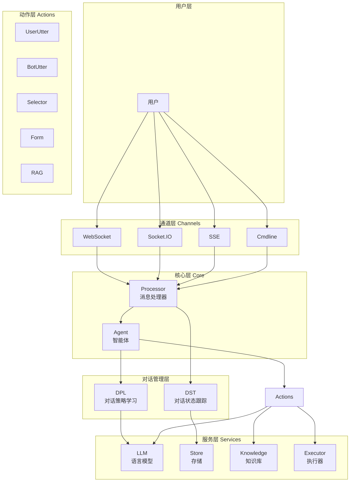

---

## 📊 数据流架构

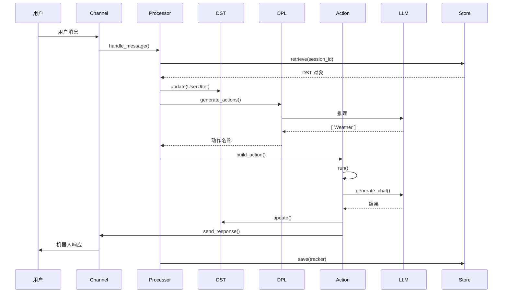

---

## 🧩 模块依赖关系

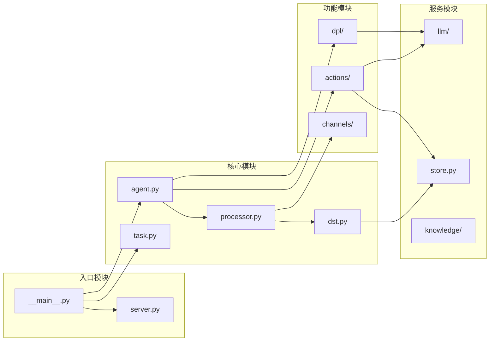

---

## 🔄 DPL 策略组合

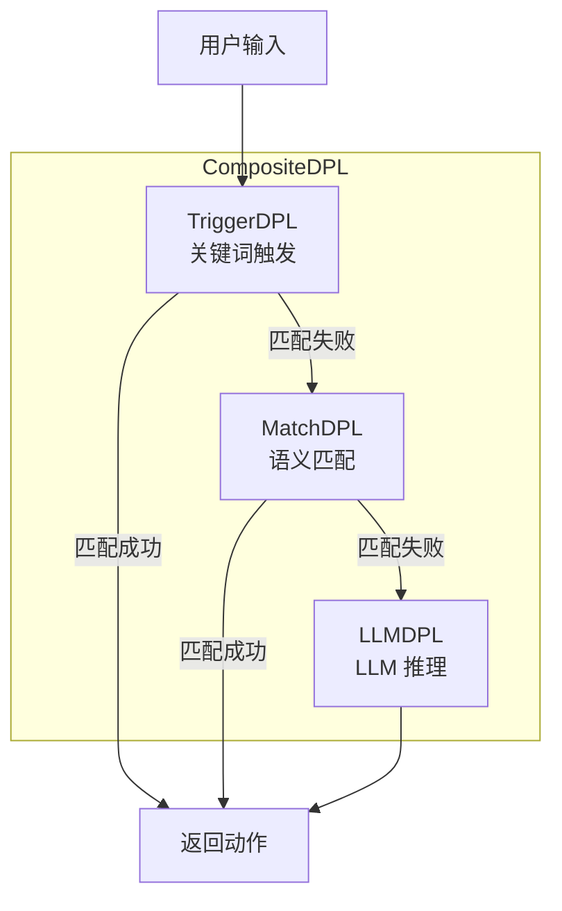

---

## 📝 DST 状态结构

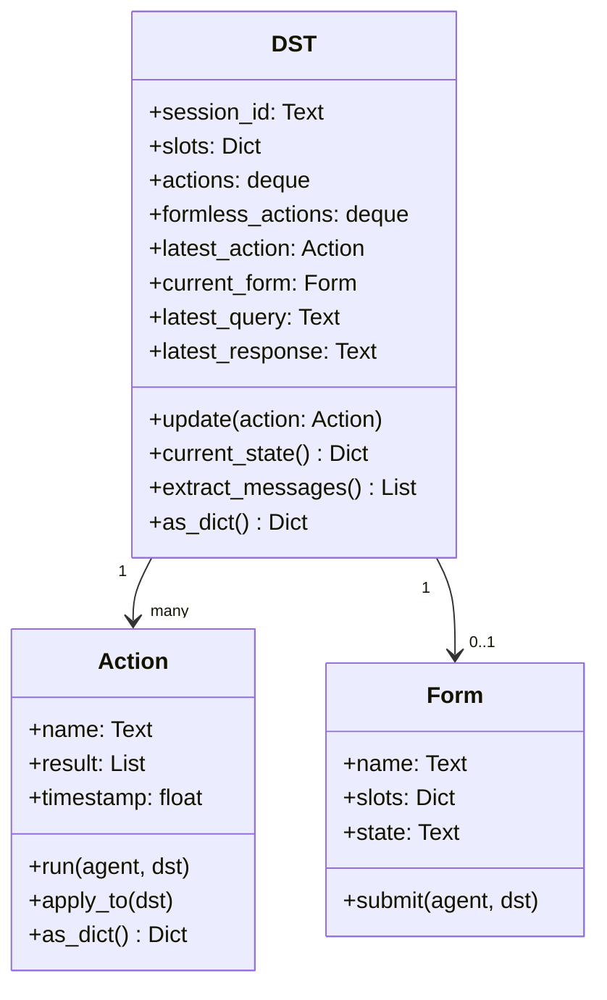

---

## 🎯 Action 类型层次

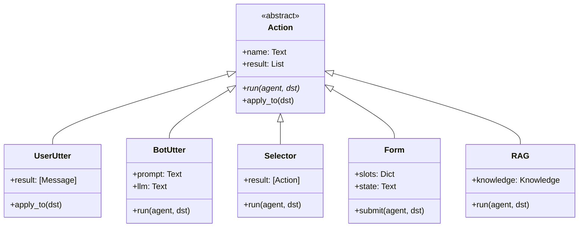

---

## 🗄️ Store 接口实现

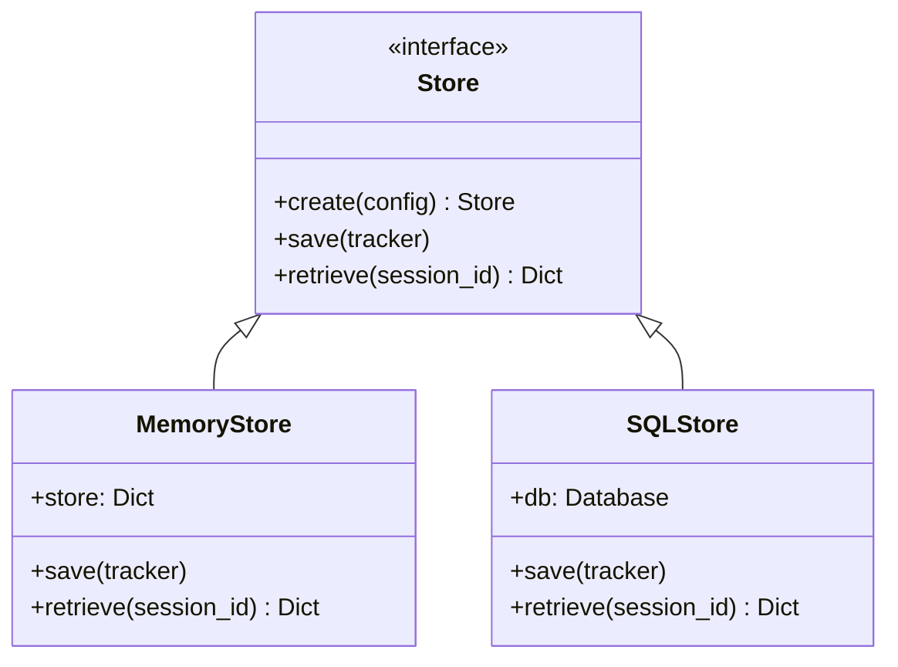

---

## 🌐 Channel 架构

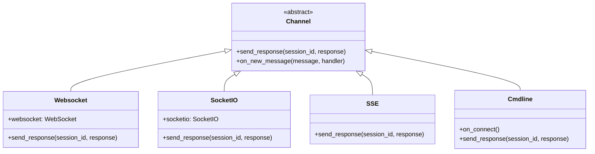

---

## 📋 配置文件结构

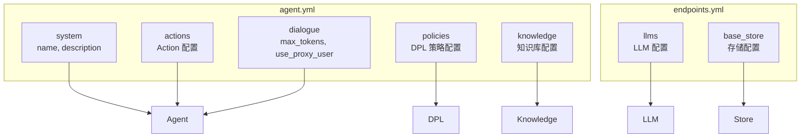

---

## 🎬 任务执行流程

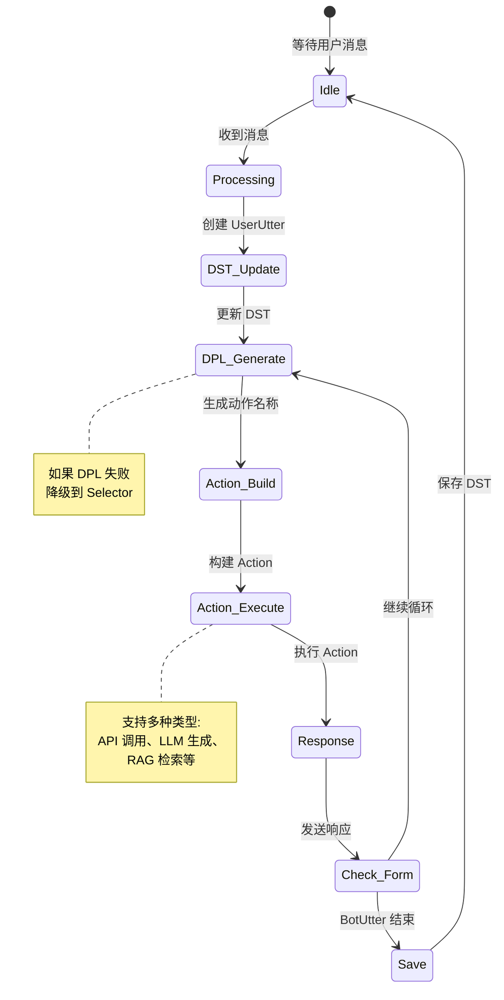

---

## 🔧 核心类关系

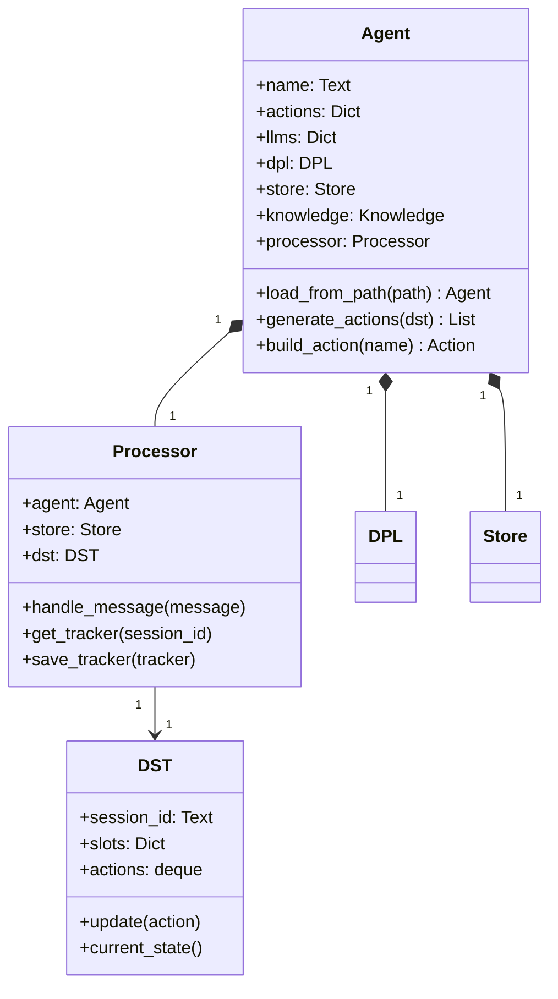

---

## 📊 性能特征

| 组件 | 时间复杂度 | 空间复杂度 | 优化建议 |
|------|-----------|-----------|---------|
| **DST update** | O(1) | O(n) | n=对话轮数 |
| **DPL generate** | O(m) | O(1) | m=策略数量 |
| **Action run** | O(1) | O(k) | k=LLM 响应长度 |
| **Store save** | O(1) | O(n) | MemoryStore |
| **Store retrieve** | O(1) | O(n) | 哈希查找 |

---

## 🎯 扩展点

### 1. 自定义 Action

```python
class CustomAction(Action):
    async def run(self, agent, dst):
        # 自定义逻辑
        self.result = [{"text": "Custom response"}]
```

### 2. 自定义 DPL 策略

```python
class CustomDPL(DPL):
    async def generate_actions(self, dst):
        # 自定义策略
        return ["CustomAction"]
```

### 3. 自定义 Channel

```python
class CustomChannel(Channel):
    async def send_response(self, session_id, response):
        # 自定义发送逻辑
        pass
```

### 4. 自定义 Store

```python
class CustomStore(Store):
    async def save(self, tracker):
        # 自定义存储逻辑
        pass
```

---

**分析完成时间**: 2026-03-16
**文件路径**: `/Users/maomin/programs/vscode/cota/detail_code_explain/04_架构图解.md`
