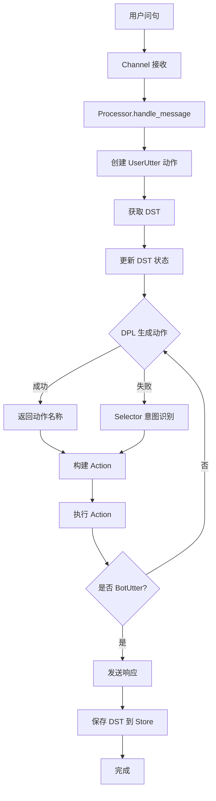

# Cota 代码分析总结

## 📋 调研概览

**分析对象**: `/Users/maomin/programs/vscode/cota`
**分析时间**: 2026-03-16
**分析方法**: 代码阅读 + 记忆检索（code-rag-skill）

---

## ✅ 问题 1：是否支持任务型对话？

### 结论：**是的，Cota 是一个完整的任务型对话系统框架**

### 核心证据

| 组件 | 支持情况 | 代码位置 |
|------|---------|---------|
| **对话状态跟踪（DST）** | ✅ 完整支持 | `cota/dst.py` |
| **槽位填充** | ✅ 支持 slots 定义和自动填充 | `cota/dst.py`, `cota/actions/form.py` |
| **表单模式** | ✅ Form 类支持任务流程 | `cota/actions/form.py` |
| **多轮对话** | ✅ 维护对话历史 deque | `cota/dst.py:actions` |
| **意图识别** | ✅ Selector + LLM | `cota/actions/selector.py` |
| **API 执行** | ✅ Executor 支持 HTTP 调用 | `cota/actions/executors/` |
| **策略学习** | ✅ DPL 支持 trigger/match/llm | `cota/dpl/` |
| **任务规划** | ✅ Task 类支持多 Agent | `cota/task.py` |

### 任务型对话特性

1. **槽位管理**
   ```python
   # DST 维护槽位状态
   self.slots = {"city": "成都", "date": "今天"}
   ```

2. **表单填写流程**
   ```yaml
   # 配置示例
   actions:
     WeatherForm:
       type: form
       slots:
         city:
           type: string
           prompt: "请问您想查询哪个城市的天气？"
         date:
           type: string
           prompt: "请问您想查询哪天的天气？"
   ```

3. **思维链驱动**
   ```yaml
   policies:
     - title: "复杂查天气"
       actions:
         - name: Selector
           thought: "用户询问两个城市天气，需要先查成都，再查重庆，然后比较"
           result: Weather
   ```

---

## 🚪 问题 2：代码入口是什么？

### 主要入口文件

| 入口 | 文件 | 功能 | 调用方式 |
|------|------|------|---------|
| **命令行总入口** | `cota/__main__.py` | 命令解析和路由 | `cota <command>` |
| **服务启动** | `cota/server.py` | 创建 Sanic 应用 | `cota run` |
| **Agent 加载** | `cota/agent.py` | 加载配置和初始化 | `Agent.load_from_path()` |
| **消息处理** | `cota/processor.py` | 处理用户消息 | `Processor.handle_message()` |
| **任务模式** | `cota/task.py` | 多 Agent 协作 | `cota task` (开发中) |

### 启动流程

```
cota shell --config=./mybot
    ↓
__main__.py:main()
    ↓
shell(args)
    ↓
Agent.load_from_path('./mybot')
    ↓
Processor.handle_message()
    ↓
对话循环
```

---

## ⚙️ 问题 3：核心机制和运作行为

### 完整流程（从用户问句开始）



### 核心机制

| 机制 | 实现 | 关键代码 |
|------|------|---------|
| **对话状态跟踪** | DST 类维护 slots、actions、forms | `dst.py` |
| **策略学习** | DPL 工厂模式，支持多种策略 | `dpl/dpl.py` |
| **动作执行** | Action 基类 + 具体实现 | `actions/action.py` |
| **多轮对话** | DST 维护对话历史 deque | `dst.py:actions` |
| **表单填写** | Form 状态机 | `actions/form.py` |
| **持久化** | Store 接口（Memory/SQL） | `store.py` |
| **通道抽象** | Channel 基类 | `channels/channel.py` |

### 运作行为示例

**用户**: "我想查询成都的天气"

**系统处理流程**:
1. ✅ 创建 UserUtter 动作
2. ✅ 获取 DST（新建或从 Store 恢复）
3. ✅ 更新 DST：`slots = {city: "成都"}`
4. ✅ DPL 生成动作：`["Weather"]`
5. ✅ 执行 Weather 动作（调用 API）
6. ✅ 更新 DST：`slots = {city: "成都", weather: "晴 20℃"}`
7. ✅ DPL 生成动作：`["BotUtter"]`
8. ✅ 执行 BotUtter（LLM 生成回复）
9. ✅ 发送响应："成都今天晴，20℃"
10. ✅ 保存 DST 到 Store

---

## 📂 问题 4：项目结构

### 目录结构

```
cota/
├── __main__.py              # 命令行入口 ⭐
├── agent.py                 # Agent 核心类 ⭐
├── processor.py             # 消息处理器 ⭐
├── dst.py                   # 对话状态跟踪器 ⭐
├── task.py                  # 任务规划器
├── store.py                 # 存储接口
├── server.py                # Sanic 服务
│
├── actions/                 # 动作模块 ⭐
│   ├── action.py           # Action 基类
│   ├── user_utter.py       # 用户输入
│   ├── bot_utter.py        # 机器人回复
│   ├── selector.py         # 意图选择
│   ├── form.py             # 表单填写
│   ├── rag.py              # RAG
│   └── executors/          # 执行器
│
├── dpl/                     # 对话策略学习 ⭐
│   ├── dpl.py              # DPL 基类和工厂
│   ├── trigger.py          # 触发式
│   ├── match.py            # 匹配式
│   └── llm.py              # LLM 驱动
│
├── channels/                # 通信通道
│   ├── channel.py          # Channel 基类
│   ├── websocket.py        # WebSocket
│   ├── socketio.py         # Socket.IO
│   ├── cmdline.py          # 命令行
│   └── sse.py              # SSE
│
├── llm/                     # LLM 接口
│   ├── llm.py              # LLM 基类
│   └── providers/          # 提供商
│
├── knowledge/               # 知识库
│   └── knowledge.py        # 知识检索
│
├── bots/                    # 机器人模板
│   └── ...                 # 示例配置
│
└── utils/                   # 工具函数
    ├── io.py               # YAML 读写
    ├── common.py           # 通用工具
    └── http.py             # HTTP 客户端
```

### 核心文件

| 文件 | 行数 | 功能 | 重要性 |
|------|------|------|--------|
| `__main__.py` | 200+ | 命令行入口 | ⭐⭐⭐ |
| `agent.py` | 300+ | Agent 核心 | ⭐⭐⭐ |
| `processor.py` | 150+ | 消息处理 | ⭐⭐⭐ |
| `dst.py` | 464 | 对话状态跟踪 | ⭐⭐⭐ |
| `dpl/dpl.py` | 150+ | 策略学习 | ⭐⭐ |
| `actions/action.py` | 100+ | 动作基类 | ⭐⭐ |
| `actions/form.py` | 200+ | 表单填写 | ⭐⭐ |

---

## 🎯 技术特点

### 优势

1. **低代码配置**
   - 通过 YAML 编写对话示例即可定义业务策略
   - 无需学习复杂的 Agent 概念

2. **思维链驱动**
   - 基于 CoT 机制，让 AI 具备类人逻辑推理能力
   - 决策过程可追溯

3. **标注式学习**
   - 通过标注 `thought` 字段自动学习策略（DPL）
   - 支持 trigger/match/llm 多种策略

4. **经典架构**
   - 遵循 DST（Dialogue State Tracker）架构
   - 稳定可靠，工业级可用

5. **多通道支持**
   - WebSocket、Socket.IO、SSE、命令行
   - 易于扩展新通道

### 适用场景

| 场景 | 适用性 | 说明 |
|------|--------|------|
| **客服对话机器人** | ⭐⭐⭐ | 多轮对话、表单填写 |
| **任务型助手** | ⭐⭐⭐ | 槽位填充、API 调用 |
| **知识问答** | ⭐⭐ | RAG 支持 |
| **多 Agent 协作** | ⭐⭐ | Task 模式（开发中） |
| **简单问答** | ⭐ | 可能过于复杂 |

---

## 📊 与 CoPaw 对比

| 特性 | Cota | CoPaw |
|------|------|-------|
| **架构** | DST + DPL | Agent + Runner |
| **配置方式** | YAML 对话示例 | Python 代码 + YAML |
| **任务型对话** | ✅ 完整支持（Form） | ✅ 支持（ReAct） |
| **思维链** | ✅ thought 字段标注 | ✅ ReAct 模式 |
| **多通道** | ✅ WebSocket/Socket.IO 等 | ✅ iMessage/钉钉等 |
| **学习成本** | 低（写对话即可） | 中（需理解 Agent） |
| **灵活性** | 中（受限于 YAML） | 高（Python 代码） |

---

## 💡 使用建议

### 快速开始

```bash
# 1. 安装
pip install cota

# 2. 初始化项目
cota init
cd cota_projects/simplebot

# 3. 配置 LLM
# 编辑 endpoints.yml，填写 API key

# 4. 启动对话
cota shell --debug
```

### 配置示例

**agent.yml**:
```yaml
system:
  name: "weather_bot"
  description: "天气查询机器人"

actions:
  Weather:
    type: "api"
    description: "查询天气"
    slots:
      city:
        type: "string"
        prompt: "请问您想查询哪个城市？"

policies:
  - type: "trigger"
  - type: "llm"
    config:
      llms: ["rag-glm-4"]
```

**endpoints.yml**:
```yaml
llms:
  rag-glm-4:
    type: openai
    model: glm-4
    key: YOUR_API_KEY
    apibase: https://api.openai.com/v1

base_store:
  type: memory
```

---

## 📝 生成的分析文档

| 文件 | 内容 | 大小 |
|------|------|------|
| `01_任务型对话能力分析.md` | 问题 1 详细分析 | 13KB |
| `02_代码入口分析.md` | 问题 2 详细分析 | 12KB |
| `03_核心机制详解.md` | 问题 3 详细分析 | 19KB |
| `04_架构图解.md` | 流程图和架构图 | - |
| `05_总结与建议.md` | 本文件 | - |

**保存位置**: `/Users/maomin/programs/vscode/cota/detail_code_explain/`

---

## 🔍 调研方法

### 使用的技能

1. **memory_search**
   - 检索记忆中关于任务型对话、CoPaw 项目分析的经验
   - 获取之前的代码分析方法论

2. **代码阅读**
   - 读取核心文件：`__main__.py`, `agent.py`, `dst.py`, `processor.py`, `task.py`
   - 分析关键类和函数

3. **目录结构分析**
   - 使用 `ls -la` 查看项目结构
   - 识别核心模块

### 分析维度

1. **功能维度**: 是否支持任务型对话
2. **架构维度**: 入口文件和启动流程
3. **机制维度**: 从用户问句到响应的完整流程
4. **结构维度**: 项目组织和模块划分

---

## ✅ 总结

### Cota 是什么？

**Cota** 是一个**工业级任务型对话系统平台**，基于思维链（Chain of Thought）和对话状态跟踪（DST）架构。

**核心理念**：通过标注式策略学习，将领域知识以思维链的形式注入对话系统，无需学习复杂的 Agent 概念，只需编写带思维链的对话示例即可构建可靠的领域 AI 助理。

### 核心优势

1. ✅ **完整的任务型对话支持**（DST + Form + DPL）
2. ✅ **清晰的入口和架构**（命令行 + 模块化）
3. ✅ **可追溯的决策过程**（思维链标注）
4. ✅ **低代码配置**（YAML 对话示例）
5. ✅ **工业级可用**（多通道、持久化、错误处理）

### 适用场景

- ✅ 客服对话机器人
- ✅ 任务型助手（订票、查询、预约等）
- ✅ 多轮对话系统
- ✅ 需要可追溯决策的场景

### 不适用场景

- ❌ 简单问答（可能过于复杂）
- ❌ 纯闲聊（缺少个性化）
- ❌ 需要高度定制的场景（受限于 YAML 配置）

---

**分析完成时间**: 2026-03-16
**分析师**: AI 助手（基于 code-rag-skill 和记忆检索）
**状态**: ✅ 完成
