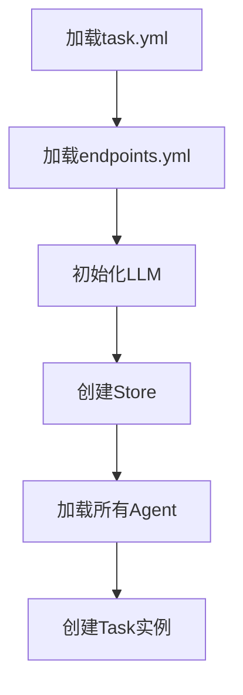
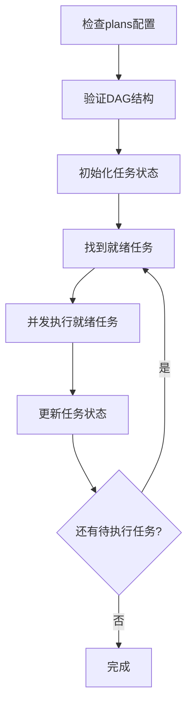
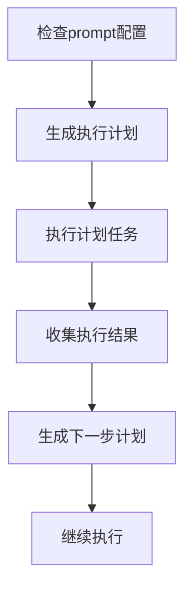

# Task (任务编排)

Task是COTA框架中的高级任务编排器，通过协调多个Agent来完成复杂的多步骤、多角色任务。它提供了灵活的任务规划、并发执行和状态管理能力，是构建复杂对话场景和多Agent协作系统的核心组件。

## 🎯 核心功能

### 1. 多Agent编排
- **Agent管理**: 统一管理多个专门化的Agent实例
- **角色分配**: 为不同Agent分配特定的角色和职责
- **协作机制**: 协调Agent之间的交互和数据传递

### 2. 任务规划
- **静态规划**: 通过预定义的plans配置任务执行顺序
- **动态规划**: 使用LLM根据上下文动态生成执行计划
- **依赖管理**: 支持任务间的依赖关系和执行条件

### 3. 并发执行
- **DAG执行**: 基于有向无环图(DAG)的并发任务执行
- **状态跟踪**: 实时跟踪任务状态（pending/completed）
- **资源控制**: 通过信号量控制并发执行的任务数量

## 🏗️ 架构设计

### Task组件结构

```
Task
├── Description (任务描述)
├── Prompt (LLM规划提示词)
├── Agents (代理集合)
│   ├── Agent01 (角色1)
│   ├── Agent02 (角色2)
│   └── ...
├── Plans (执行计划)
│   ├── Task1 (子任务1)
│   ├── Task2 (子任务2)
│   └── Dependencies (依赖关系)
└── LLM (规划语言模型)
```

### 执行模式

COTA Task支持两种执行模式：

#### 1. 预定义计划模式 (Plans-based)

使用静态配置的DAG结构定义任务执行流程：

```yaml
# task.yml
plans:
  - name: task1
    agent: doctor_agent
    startquery: "用户咨询：我家猫咪拉肚子了"
    dependencies: []
  
  - name: task2
    agent: user_agent  
    startquery: "继续询问：还有其他症状吗？"
    dependencies: [task1]
    
  - name: task3
    agent: doctor_agent
    startquery: "提供建议：建议做进一步检查"
    dependencies: [task2]
```

#### 2. LLM动态规划模式 (Prompt-based)

通过大语言模型动态生成执行计划：

```yaml
# task.yml  
prompt: |
  你是一个任务规划器，根据任务描述和历史对话，选择下一步指派哪个agent来执行
  
  任务描述：
  {{task_description}}
  
  agents描述为: 
  {{agent_description}}
  
  请根据当前的对话状态：
  {{history_messages}}
  
  请指派下一步agent，请按照如下JSON格式输出：
  {"agent": "<选择的agent的名字>"}
```

## 📁 项目结构

### Task项目目录结构

```
multi_agent_task/
├── task.yml              # 任务配置文件
├── endpoints.yml         # 端点配置文件
└── agents/              # 代理目录
    ├── doctor_agent/    # 代理1 (如：医生角色)
    │   ├── agent.yml    # 代理配置
    │   └── endpoints.yml # 代理端点配置
    ├── patient_agent/   # 代理2 (如：患者角色)
    │   ├── agent.yml    # 代理配置
    │   └── endpoints.yml # 代理端点配置
    └── ...
```

**注意**：Task功能目前处于开发阶段，主要用于复杂的多Agent协作场景。对于简单的单Agent应用，建议直接使用Agent模式。

### 配置文件详解

#### task.yml - 任务配置

```yaml
# 任务描述
description: "模拟一段用户和咨询医生宠物问题的场景对话"

# LLM规划提示词（动态模式）
prompt: |
  你是一个任务规划器，根据任务描述和历史对话，选择下一步指派哪个agent来执行
  
  任务描述：{{task_description}}
  agents描述为: {{agent_description}}
  
  请根据当前的对话状态：{{history_messages}}
  请指派下一步agent，请按照如下JSON格式输出：
  {"agent": '<选择的agent的名字>'}

# 预定义计划（静态模式）
plans:
  - name: consultation_start
    agent: user_agent
    startquery: "你家猫生病了，拉肚子，需要找医生咨询"
    dependencies: []
    
  - name: doctor_response
    agent: doctor_agent
    startquery: "/start"
    dependencies: [consultation_start]
    
  - name: follow_up_question
    agent: user_agent
    startquery: "还需要做什么检查吗？"
    dependencies: [doctor_response]
```

#### agent.yml - 代理配置

```yaml
# 代理基本信息
system:
  name: doctor_agent
  description: "你是一名专业的宠物医生，需要认真负责地回答用户问题"

# 对话配置
dialogue:
  use_proxy_user: true   # 启用代理用户模式用于多Agent交互
  max_proxy_step: 20     # 代理模式下的最大步骤数
  max_tokens: 500        # LLM生成最大令牌数

# 对话策略
policies:
  - type: trigger
  - type: match
  - type: llm
    config:
      llms:
        - name: qwen-max
          action: BotUtter
        - name: deepseek-chat

# 动作定义
actions:
  UserUtter:
    description: "用户向医生的提问"
    prompt: |
      你是一个需要医疗帮助的宠物主人，向专业的宠物医生咨询问题。
      
      **历史对话：**
      {{history_messages}}
      
      **输出格式：**
      ```json
      {
        "thought": "你的内心想法",
        "text": "你要说的话", 
        "state": "continue/stop"
      }
      ```
    
  BotUtter:
    description: "专业医生回复用户"
    prompt: |
      你是专业的宠物医生，需要根据对话历史提供专业建议。
      
      **任务描述：**
      {{task_description}}
      
      **对话历史：**
      {{history_actions_with_thoughts}}
      
      **输出格式：**
      ```json
      {"thought": "<专业分析>", "text": "<医疗建议>"}
      ```
      
  Selector:
    description: "选择合适的Actions"
    prompt: |
      根据当前对话状态选择下一个最合适的Action。
      
      **可用Actions：**
      {{action_descriptions}}
      
      **对话状态：**
      {{history_actions_with_thoughts}}
      
      **输出格式：**
      ```json
      {"thought": "<分析过程>", "action": "<动作名称>"}
      ```
```

## ⚙️ 核心API

### Task类主要方法

```python
from cota.task import Task

# 1. 从路径加载任务
task = Task.load_from_path("path/to/taskbot")

# 2. 运行任务（自动选择执行模式）
await task.run()

# 3. 基于计划运行（静态模式）
await task.run_with_plan(max_concurrent_tasks=5)

# 4. 基于LLM运行（动态模式）
await task.run_with_llm()

# 5. 生成执行计划
plans = await task.generate_plans()

# 6. 执行单个子任务
await task.execute_task(task_config)
```

### 辅助方法

```python
# 获取代理描述
agent_desc = task.agent_description()

# 获取任务描述  
task_desc = task.task_description()

# 获取历史消息
history = task.history_messages()

# 获取当前计划
current_plan = task.current_plan()
```

## 🔄 工作流程

### 1. 初始化阶段



### 2. 执行阶段

#### 静态计划执行流程



#### 动态规划执行流程



### 3. 任务执行细节

每个子任务的执行过程：

1. **参数解析**: 解析startquery中的槽位和参数
2. **消息构建**: 创建Message对象
3. **Agent调用**: 通过Agent的processor处理消息
4. **结果收集**: 收集Agent的响应结果
5. **状态更新**: 更新任务执行状态

## 🚀 使用场景

### 1. 多角色对话场景

**场景**: 医患咨询对话
- **Agent01**: 医生角色，提供专业建议
- **Agent02**: 患者角色，描述症状和提问
- **Task**: 协调对话流程，确保信息传递

```yaml
description: "宠物医疗咨询对话场景"
agents:
  - doctor_agent: 专业宠物医生
  - patient_agent: 宠物主人
```

### 2. 业务流程自动化

**场景**: 客服处理流程
- **Agent01**: 问题分类器
- **Agent02**: 技术支持专家
- **Agent03**: 售后服务专家
- **Task**: 根据问题类型路由到相应专家

### 3. 教学辅导系统

**场景**: 在线教学
- **Agent01**: 教师角色，讲解知识点
- **Agent02**: 学生角色，提问和反馈
- **Agent03**: 评估器，评估学习效果
- **Task**: 协调教学流程

### 4. 游戏NPC系统

**场景**: 角色扮演游戏
- **多个NPC Agent**: 不同性格和职业的NPC
- **Task**: 根据游戏情节安排NPC交互

## 📊 性能优化

### 1. 并发控制

```python
# 控制最大并发任务数
await task.run_with_plan(max_concurrent_tasks=3)

# 使用信号量控制资源
semaphore = asyncio.Semaphore(max_concurrent_tasks)
```

### 2. 内存管理

- **Agent复用**: 相同配置的Agent实例复用
- **状态清理**: 及时清理完成任务的状态数据
- **连接池**: 数据库和HTTP连接复用

### 3. 错误处理

```python
try:
    await asyncio.gather(*tasks)
except Exception as e:
    logger.error(f"Error executing tasks: {e}")
    # 实现错误恢复逻辑
    raise
```

## 🛠️ 最佳实践

### 1. 任务设计原则

- **单一职责**: 每个Agent承担明确的单一职责
- **松耦合**: Agent之间通过Message松散耦合
- **可测试**: 每个Agent都可独立测试
- **可扩展**: 支持动态添加新的Agent类型

### 2. 配置管理

- **环境隔离**: 不同环境使用不同的endpoints配置
- **敏感信息**: 使用环境变量管理API密钥等敏感信息
- **版本控制**: 配置文件纳入版本控制管理

### 3. 监控和调试

```python
# 启用详细日志
import logging
logging.getLogger('cota.task').setLevel(logging.DEBUG)

# 监控任务执行状态
logger.debug(f"Task {task_name} status: {status}")
logger.debug(f"Agent response: {response}")
```

### 4. 错误恢复

- **重试机制**: 对失败的任务实现重试
- **降级策略**: 当某个Agent不可用时的降级处理
- **检查点**: 在关键节点保存执行状态

## 🔍 调试指南

### 常见问题排查

1. **DAG验证失败**
   ```python
   # 检查plans中是否存在循环依赖
   from cota.utils.common import is_dag
   if not is_dag(plans):
       print("Plans contain circular dependencies")
   ```

2. **Agent初始化失败**
   ```python
   # 检查Agent配置文件
   agent_config = read_yaml_from_path("agent.yml")
   print("Agent config:", agent_config)
   ```

3. **LLM规划失败**
   ```python
   # 检查prompt模板和变量替换
   formatted_prompt = task.format_prompt(task.prompt)
   print("Formatted prompt:", formatted_prompt)
   ```

### 性能监控

```python
import time

# 监控任务执行时间
start_time = time.time()
await task.run()
execution_time = time.time() - start_time
logger.info(f"Task execution time: {execution_time:.2f}s")
```

## 🌟 扩展开发

### 自定义任务类型

可以继承Task类实现特定领域的任务编排器：

```python
from cota.task import Task

class GameTask(Task):
    """游戏场景任务编排器"""
    
    async def run_game_scenario(self):
        # 实现游戏特定的执行逻辑
        pass
    
    def get_npc_agent(self, npc_type: str):
        # 根据NPC类型获取对应的Agent
        return self.agents.get(f"{npc_type}_agent")
```

### 插件集成

Task与COTA其他组件的集成：

- **Agent**: 管理和调度多个智能代理
- **DST**: 跟踪每个Agent的对话状态
- **DPL**: 为每个Agent提供决策支持
- **Store**: 共享任务执行过程中的数据
- **LLM**: 提供动态规划和决策能力

---

Task作为COTA的任务编排核心，为构建复杂的多Agent协作系统提供了强大而灵活的基础设施，是实现高级AI应用场景的关键组件。
