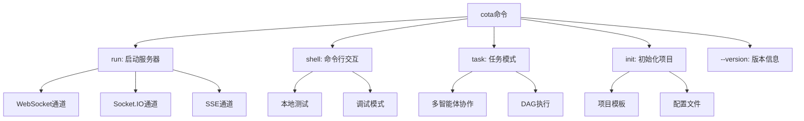

# 命令行工具

COTA提供了功能强大的命令行工具，支持多种运行模式和配置选项。本文档详细介绍各种命令的使用方法和最佳实践。

## 📋 命令概览

COTA命令行工具提供以下主要功能：



### 基本语法

```bash
cota [global_options] <command> [command_options]
```

### 全局选项

| 选项 | 说明 | 示例 |
|------|------|------|
| `--version` | 显示COTA版本 | `cota --version` |
| `-h, --help` | 显示帮助信息 | `cota --help` |

## 🚀 run命令 - 启动服务器

`cota run` 命令用于启动COTA服务器，支持多种通道和配置选项。

### 命令语法

```bash
cota run [OPTIONS]
```

### 基本选项

| 选项 | 类型 | 默认值 | 说明 |
|------|------|---------|------|
| `--host` | string | `0.0.0.0` | 服务器绑定主机地址 |
| `--port` | integer | `5005` | 服务器监听端口 |
| `--config` | string | `./` | 智能体配置目录路径 |
| `--channel` | string | `socket.io` | 消息通道类型 |
| `--debug` | flag | `False` | 启用调试模式 |
| `--log` | string | `INFO` | 日志级别 |
| `--ssl-cert` | string | - | SSL证书文件路径 |
| `--ssl-key` | string | - | SSL私钥文件路径 |

### 支持的通道类型

#### 1. Socket.IO通道（默认）

最适合Web应用集成，支持跨平台实时通信。

```bash
# 基本启动
cota run --channel=socket.io

# 自定义端口
cota run --channel=socket.io --port=8080

# 生产环境配置
cota run \
  --channel=socket.io \
  --config=/path/to/bot/config \
  --host=0.0.0.0 \
  --port=5005 \
  --log=INFO
```

**Socket.IO配置特性**：
- 自动重连机制
- 跨域支持 
- 事件驱动通信
- 房间和命名空间支持

#### 2. WebSocket通道

原生WebSocket支持，适合需要高性能实时通信的场景。

```bash
# WebSocket启动
cota run --channel=websocket

# 配置连接超时
cota run \
  --channel=websocket \
  --config=bots/simplebot \
  --debug
```

**WebSocket配置特性**：
- 连接超时: 1000秒
- 房间超时: 3600秒
- 二进制数据支持
- 低延迟通信

#### 3. SSE通道（Server-Sent Events）

适合单向推送场景，如实时通知和状态更新。

```bash
# SSE启动
cota run --channel=sse

# SSE生产配置  
cota run \
  --channel=sse \
  --host=localhost \
  --port=5005 \
  --log=WARNING
```

**SSE配置特性**：
- 连接超时: 1000秒
- 房间超时: 3600秒
- 自动重连支持
- 事件流格式

### SSL/HTTPS配置

启用SSL加密连接，保护数据传输安全。

```bash
# 使用SSL证书
cota run \
  --ssl-cert=/path/to/certificate.crt \
  --ssl-key=/path/to/private.key \
  --host=0.0.0.0 \
  --port=443

# 开发环境自签名证书
cota run \
  --ssl-cert=dev.crt \
  --ssl-key=dev.key \
  --debug
```

**SSL证书要求**：
- 证书格式: PEM
- 支持通配符证书
- 支持证书链
- 自动HTTPS重定向

### 配置目录结构

COTA服务器需要正确的配置目录结构：

```
config_directory/
├── agent.yml          # 智能体配置
├── endpoints.yml      # 端点配置  
├── policy/           # 策略配置目录
│   ├── data.yml      # 对话策略数据
│   └── rules.yml     # 触发规则
└── logs/            # 日志目录（可选）
```

### 日志级别

| 级别 | 说明 | 用途 |
|------|------|------|
| `DEBUG` | 详细调试信息 | 开发调试 |
| `INFO` | 一般信息 | 正常运行 |
| `WARNING` | 警告信息 | 生产监控 |
| `ERROR` | 错误信息 | 错误追踪 |
| `CRITICAL` | 严重错误 | 紧急处理 |

### 使用示例

**开发环境启动**：
```bash
# 最简启动
cota run

# 调试模式
cota run --debug --config=./my_bot

# 自定义端口和日志
cota run \
  --port=8080 \
  --log=DEBUG \
  --channel=websocket
```

**生产环境启动**：
```bash
# 生产配置
cota run \
  --config=/opt/cota/bots/production_bot \
  --channel=socket.io \
  --host=0.0.0.0 \
  --port=5005 \
  --log=INFO

# 带SSL的生产环境
cota run \
  --config=/opt/cota/bots/production_bot \
  --host=0.0.0.0 \
  --port=443 \
  --ssl-cert=/etc/ssl/certs/domain.crt \
  --ssl-key=/etc/ssl/private/domain.key \
  --log=WARNING
```

**集群部署**：
```bash
# 节点1
cota run --config=./bot --port=5005 --channel=websocket

# 节点2  
cota run --config=./bot --port=5006 --channel=websocket

# 节点3
cota run --config=./bot --port=5007 --channel=websocket
```

## 💬 shell命令 - 命令行交互

`cota shell` 命令提供命令行交互模式，适合本地测试和调试。

### 命令语法

```bash
cota shell [OPTIONS]
```

### 选项

| 选项 | 类型 | 默认值 | 说明 |
|------|------|---------|------|
| `--config` | string | `./` | 智能体配置目录 |
| `--log` | string | `INFO` | 日志级别 |
| `--debug` | flag | `False` | 启用调试模式 |

### 交互模式

启动后进入交互式对话模式：

```bash
$ cota shell --config=./bots/simplebot --debug

Agent loaded. Type a message and press enter.
[COTA] >>> 你好
[Bot] 您好！我是COTA智能助手，有什么可以帮您的吗？

[COTA] >>> 查询今天天气
[Bot] 请问您想查询哪个城市的天气？

[COTA] >>> 北京
[Bot] 北京今天晴天，温度25°C，湿度60%

[COTA] >>> exit
Goodbye!
```

### 调试功能

在调试模式下，shell提供额外的调试信息：

```bash
$ cota shell --debug

Agent loaded. Type a message and press enter.
[DEBUG] Agent configuration loaded: /path/to/agent.yml
[DEBUG] DPL policies: ['trigger', 'match', 'rag']
[DEBUG] Available actions: ['Weather', 'Calculator', 'Query']

[COTA] >>> 你好
[DEBUG] Processing message: '你好'
[DEBUG] Generated action: UserUtter
[DEBUG] DST updated: session_12345
[DEBUG] Generated bot actions: ['BotUtter']
[Bot] 您好！我是COTA智能助手，有什么可以帮您的吗？
```

### 特殊命令

Shell模式支持以下特殊命令：

| 命令 | 说明 |
|------|------|
| `exit` | 退出Shell |
| `quit` | 退出Shell |
| `/status` | 显示智能体状态 |
| `/history` | 显示对话历史 |
| `/clear` | 清除对话历史 |
| `/debug on` | 启用调试输出 |
| `/debug off` | 禁用调试输出 |

### 使用场景

**快速测试**：
```bash
# 测试新配置
cota shell --config=./new_bot_config

# 调试对话流程
cota shell --debug --config=./bot
```

**对话验证**：
```bash
# 验证多轮对话
cota shell --config=./complex_bot
```

## 🔧 task命令 - 任务模式

`cota task` 命令用于执行多智能体协作任务，支持DAG工作流。

### 命令语法

```bash
cota task [OPTIONS]
```

### 选项

| 选项 | 类型 | 默认值 | 说明 |
|------|------|---------|------|
| `--config` | string | `./` | 任务配置目录 |
| `--log` | string | `INFO` | 日志级别 |
| `--debug` | flag | `False` | 启用调试模式 |

### 任务配置

任务模式需要以下配置文件：

```
task_directory/
├── task.yml           # 任务配置
├── endpoints.yml      # 端点配置
└── agents/           # 智能体目录
    ├── agent01/      # 智能体1
    │   ├── agent.yml
    │   └── endpoints.yml
    ├── agent02/      # 智能体2
    │   ├── agent.yml  
    │   └── endpoints.yml
    └── ...
```

### 任务执行

```bash
# 基本任务执行
$ cota task --config=./taskbot

Task loaded.
[INFO] Starting task execution...
[INFO] Loading agents: agent01, agent02, agent03
[INFO] Generating execution plan...
[INFO] Executing DAG workflow...

Task 1: Data Collection (agent01) - RUNNING
Task 2: Data Processing (agent02) - PENDING  
Task 3: Report Generation (agent03) - PENDING

Task 1: Data Collection (agent01) - COMPLETED
Task 2: Data Processing (agent02) - RUNNING
Task 3: Report Generation (agent03) - PENDING

Task 2: Data Processing (agent02) - COMPLETED
Task 3: Report Generation (agent03) - RUNNING

Task 3: Report Generation (agent03) - COMPLETED

[INFO] All tasks completed successfully!
```

### 调试模式

```bash
$ cota task --debug --config=./taskbot

Task loaded.
[DEBUG] Task configuration: /path/to/task.yml
[DEBUG] Available agents: ['agent01', 'agent02', 'agent03']
[DEBUG] Task dependencies: {...}
[DEBUG] Generated DAG: {...}

[INFO] Starting task execution...
[DEBUG] Task 1 starting with input: {...}
[DEBUG] Task 1 completed with output: {...}
[DEBUG] Task 2 starting with input: {...}
```

### 并发控制

```bash
# 限制并发任务数
cota task --config=./taskbot --max-concurrent=3

# 单线程执行（调试用）
cota task --config=./taskbot --max-concurrent=1
```

## 🎨 init命令 - 项目初始化

`cota init` 命令用于创建新的COTA项目，生成标准的配置文件模板。

### 命令语法

```bash
cota init [OPTIONS]
```

### 选项

| 选项 | 类型 | 默认值 | 说明 |
|------|------|---------|------|
| `--log` | string | `INFO` | 日志级别 |

### 初始化过程

```bash
$ cota init

Created directory: cota_projects
Copying template files...
[INFO] Project initialized successfully!

Project structure:
cota_projects/
├── simplebot/
│   ├── agent.yml
│   ├── endpoints.yml.example
│   └── policy/
│       ├── data.yml
│       └── rules.yml
└── taskbot/
    ├── task.yml
    ├── endpoints.yml.example
    └── agents/
        ├── agent01/
        └── agent02/
```

### 项目模板

初始化后会创建以下模板文件：

**智能体配置** (`agent.yml`):
```yaml
# COTA智能体配置模板
description: "COTA智能助手"
version: "1.0.0"

system:
  name: "assistant"
  description: "智能对话助手"

dialogue:
  mode: "policy"
  max_tokens: 2000

policies:
  - name: "trigger"
  - name: "match" 
  - name: "rag"
    llm: "gpt-3.5-turbo"

actions:
  Weather:
    description: "查询天气信息"
    prompt: "请查询{{city}}的天气情况"
    executor:
      type: "http"
      method: "GET"
      url: "https://api.weather.com/v1/weather"
```

**端点配置** (`endpoints.yml.example`):
```yaml
# 数据存储配置
data_store:
  type: "memory"  # 或 "sql"
  
# LLM配置
llm:
  gpt-3.5-turbo:
    type: "openai"
    api_key: "${OPENAI_API_KEY}"
    base_url: "https://api.openai.com/v1"
    model: "gpt-3.5-turbo"
    max_tokens: 2000
    temperature: 0.7

# 通道缓存配置
channel:
  type: "memory"
  ttl: 3600
```

### 配置步骤

1. **复制示例配置**：
```bash
cd cota_projects/simplebot
cp endpoints.yml.example endpoints.yml
```

2. **配置API密钥**：
```bash
# 设置环境变量
export OPENAI_API_KEY="your_api_key_here"

# 或编辑配置文件
vim endpoints.yml
```

3. **测试配置**：
```bash
# 测试智能体
cota shell --config=./simplebot

# 启动服务
cota run --config=./simplebot --debug
```

## 🔧 高级用法

### 环境变量配置

COTA支持通过环境变量进行配置：

```bash
# 服务配置
export COTA_HOST=0.0.0.0
export COTA_PORT=5005
export COTA_DEBUG=true
export COTA_LOG_LEVEL=DEBUG

# 使用环境变量启动
cota run --config=./bot
```

### 配置文件覆盖

```bash
# 指定不同的配置文件
cota run \
  --config=./bot \
  --endpoints-config=./production_endpoints.yml \
  --agent-config=./production_agent.yml
```

### 进程管理

**使用systemd管理**：
```bash
# 创建服务文件
sudo tee /etc/systemd/system/cota.service > /dev/null <<EOF
[Unit]
Description=COTA Service
After=network.target

[Service]
Type=simple
User=cota
WorkingDirectory=/opt/cota
ExecStart=/opt/cota/venv/bin/cota run --config=/opt/cota/config
Restart=always

[Install]
WantedBy=multi-user.target
EOF

# 启动服务
sudo systemctl daemon-reload
sudo systemctl enable cota
sudo systemctl start cota
```

**使用supervisor管理**：
```ini
[program:cota]
command=/path/to/venv/bin/cota run --config=/path/to/config
directory=/path/to/cota
user=cota
autostart=true
autorestart=true
redirect_stderr=true
stdout_logfile=/var/log/cota/cota.log
```

### 性能调优

**内存优化**：
```bash
# 设置内存限制
cota run --config=./bot --memory-limit=1G

# 启用垃圾回收优化
export PYTHONOPTIMIZE=2
cota run --config=./bot
```

**并发优化**：
```bash
# 多进程模式
cota run --config=./bot --workers=4

# 异步优化
cota run --config=./bot --async-workers=10
```

### 监控和日志

**结构化日志**：
```bash
# JSON格式日志
cota run --config=./bot --log-format=json

# 自定义日志文件
cota run --config=./bot --log-file=/var/log/cota/app.log
```

**健康检查**：
```bash
# 启用健康检查端点
cota run --config=./bot --health-check=true

# 检查服务状态
curl http://localhost:5005/health
```

### 故障排除

**常见问题检查**：
```bash
# 检查配置文件
cota validate --config=./bot

# 测试连接
cota test --config=./bot --endpoint=llm

# 诊断模式
cota run --config=./bot --diagnose
```

**调试工具**：
```bash
# 详细错误信息
cota run --config=./bot --verbose

# 性能分析
cota run --config=./bot --profile

# 内存使用分析
cota run --config=./bot --memory-profile
```

COTA的命令行工具提供了灵活而强大的功能，适合各种部署和使用场景。通过合理配置和使用这些命令，可以最大化COTA的性能和可靠性。
