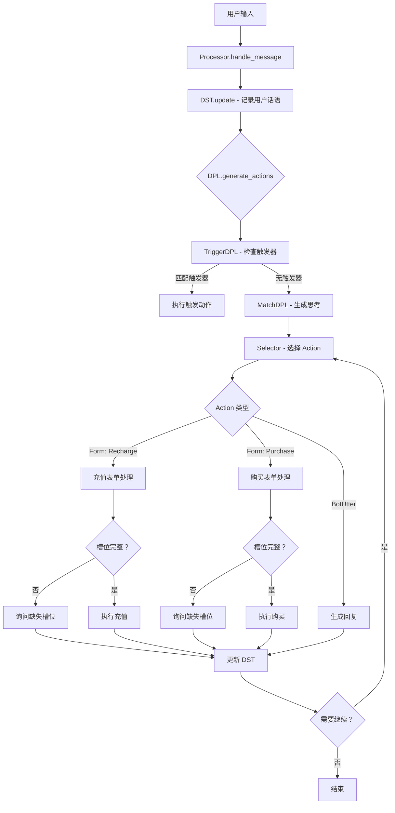

# 收银任务型对话系统 - ReAct 架构设计

## 1. 优化后的流程图



## 2. 核心机制说明

### 2.1 思考模块 (DPL + Selector)

**原方案问题**: 每次让大模型"拆分不同行为"效率低，容易出错

**优化方案**: 分层思考
1. **DPL 层**: 判断当前对话阶段 (哪个 Form 在进行)
2. **Selector 层**: 根据 Form 状态选择具体 Action

### 2.2 行为拆分 (Form-based)

定义两个主要 Form:
- `RechargeForm`: 用户充值
- `PurchaseForm`: 用户购买

每个 Form 有自己的槽位和状态机:
```
Form State: start → continue → end
```

### 2.3 槽位管理

| Form | 槽位 | 类型 | 必填 | 验证 |
|------|------|------|------|------|
| RechargeForm | amount | 金额 | 是 | >0 |
| RechargeForm | payment_method | 支付方式 | 是 | enum |
| PurchaseForm | product | 产品名 | 是 | 存在性 |
| PurchaseForm | unit_price | 单价 | 是 | >0 |
| PurchaseForm | quantity | 数量 | 是 | 整数>0 |
| PurchaseForm | total_amount | 总金额 | 计算 | =单价×数量 |

## 3. 配置文件示例

### 3.1 agent.yml

```yaml
system:
  name: CashierBot
  description: 你是一个收银助手，帮助用户完成充值和购买操作

dialogue:
  use_proxy_user: false
  max_proxy_step: 30
  max_tokens: 500

policies:
  - type: trigger      # 优先处理触发器 (如转人工)
  - type: match        # 使用 LLM 匹配当前状态

actions:
  BotUtter:
    description: "回复用户"
    prompt: |
      你是一个收银助手，需要根据当前对话状态生成回复。
      
      **当前表单状态:**
      {{current_form_state}}
      
      **已填充槽位:**
      {{current_form_slots}}
      
      **对话历史:**
      {{history_actions_with_thoughts}}
      
      请生成 JSON 格式回复:
      {"text": "<回复内容>", "thought": "<思考过程>"}

  Selector:
    description: "选择下一个 Action"
    prompt: |
      根据当前对话状态选择下一个 Action。
      
      **可用 Actions:**
      {{action_descriptions}}
      
      **当前 Form:** {{current_form_name}}
      **Form 状态:** {{current_form_state}}
      **缺失槽位:** {{missing_slots}}
      
      **对话历史:**
      {{history_actions_with_thoughts}}
      
      输出 JSON:
      {"thought": "<选择理由>", "action": "<Action 名称>"}

  Recharge:
    description: "处理用户充值"
    type: form
    state: start  # start/continue/end
    slots:
      amount:
        description: 充值金额
        type: number
        required: true
        validation: "value > 0"
        prompt: |
          请询问用户要充值多少金额。
          输出 JSON: {"text": "<询问内容>"}
      
      payment_method:
        description: 支付方式 (微信/支付宝/银行卡)
        type: string
        required: true
        enum: ["微信", "支付宝", "银行卡"]
        prompt: |
          请询问用户选择哪种支付方式。
          输出 JSON: {"text": "<询问内容>"}
    
    executor:
      type: python
      script: |
        # 充值执行逻辑
        result = recharge_user(amount, payment_method)
        return {"status": "success", "balance": result.new_balance}

  Purchase:
    description: "处理用户购买"
    type: form
    state: start
    slots:
      product:
        description: 产品名称
        type: string
        required: true
        prompt: |
          请询问用户要购买什么产品。
          输出 JSON: {"text": "<询问内容>"}
      
      unit_price:
        description: 产品单价
        type: number
        required: true
        validation: "value > 0"
        prompt: |
          请确认或询问产品单价。
          输出 JSON: {"text": "<询问内容>"}
      
      quantity:
        description: 购买数量
        type: integer
        required: true
        validation: "value > 0"
        prompt: |
          请询问用户要购买多少件。
          输出 JSON: {"text": "<询问内容>"}
    
    executor:
      type: python
      script: |
        total = unit_price * quantity
        result = process_purchase(product, quantity, total)
        return {"status": "success", "order_id": result.order_id}
```

### 3.2 policy/rules.yml (触发器规则)

```yaml
triggers:
  - title: 转人工
    condition:
      - name: UserUtter
        keywords: ["转人工", "人工客服", "人工服务"]
    next_action: RenGong

  - title: 开始充值
    condition:
      - name: UserUtter
        keywords: ["充值", "存钱", "入账"]
    next_action: Recharge
    form_state: start

  - title: 开始购买
    condition:
      - name: UserUtter
        keywords: ["买", "购买", "下单"]
    next_action: Purchase
    form_state: start

  - title: 取消操作
    condition:
      - name: UserUtter
        keywords: ["取消", "不要了", "退出"]
    next_action: CancelForm
```

## 4. 实现步骤

### Step 1: 创建收银 Bot 目录结构
```
cota/bots/cashier/
├── agent.yml          # 主配置
├── endpoints.yml      # LLM 和存储配置
└── policy/
    └── rules.yml      # 触发器规则
```

### Step 2: 实现 Form 验证逻辑
- 扩展现有 Form 类，添加槽位验证
- 实现自动计算槽位 (如 total_amount = unit_price × quantity)

### Step 3: 实现 Executor
- 充值执行器：调用支付接口
- 购买执行器：调用订单系统

### Step 4: 测试流程
1. 用户说"我要充值 100 元"
2. DST 更新，DPL 触发 Recharge Form
3. Form 检查槽位：amount=100, payment_method=?
4. Selector 选择询问 payment_method
5. 用户回答"微信"
6. Form 槽位完整，执行充值
7. 返回结果，Form 结束

## 5. 与原方案对比

| 方面 | 原方案 | 优化方案 |
|------|--------|----------|
| 思考粒度 | 每次拆分所有行为 | 分层：DPL 定阶段，Selector 定动作 |
| Form 管理 | 隐式 | 显式 state 机 (start/continue/end) |
| 槽位验证 | 无 | 内置 validation 规则 |
| 触发器 | 无 | 优先处理，快速响应 |
| 扩展性 | 需修改 prompt | 配置驱动，易添加新 Form |

## 6. 关键代码修改点

1. **Form 类扩展**: 添加槽位验证逻辑
2. **DPL 扩展**: 添加 Form 状态感知
3. **Selector prompt**: 增加 Form 状态上下文
4. **Processor**: 支持 Form 状态流转
